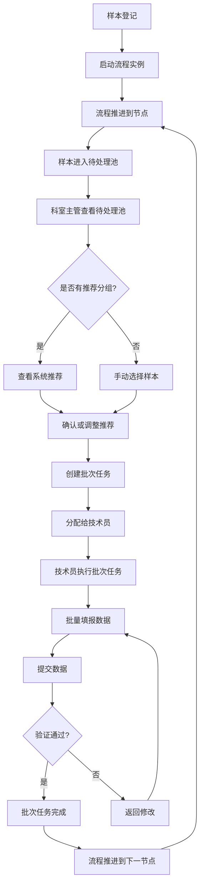
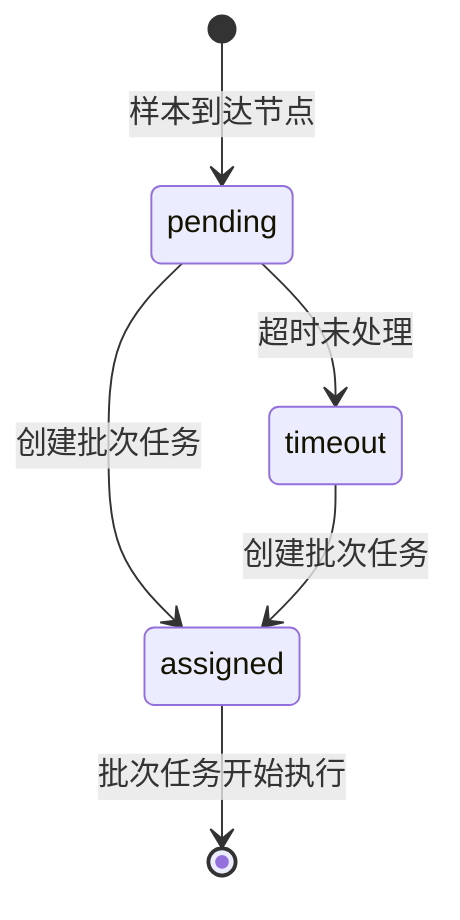
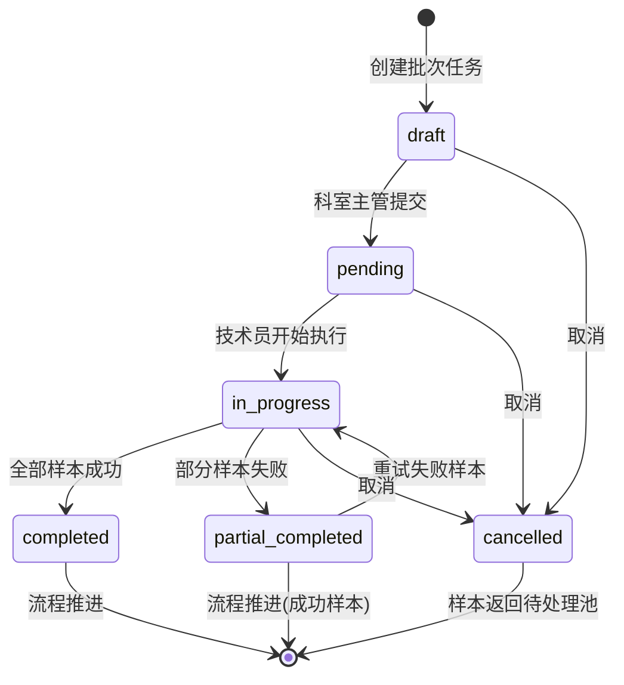

# 测序流程配置系统 - 产品需求文档

**文档版本**: v2.0
**编制日期**: 2026-02-26
**产品名称**: ArkOne 测序流程配置系统
**目标用户**: 生物测序实验室管理人员、技术人员

---

## 一、产品概述

### 1.1 产品定义

ArkOne 测序流程配置系统是一个支持动态工作流配置的生物测序 LIMS（实验室信息管理系统）。系统能够根据样本类型自动调整流程节点，在每个节点记录特定的实验数据字段，实现样本全生命周期的追踪和管理。

### 1.2 核心价值主张

- **灵活的流程配置**: 支持多种测序类型和样本类型的动态工作流配置
- **精准的样本追踪**: 实现样本从登记到完成的全过程追踪，准确率 > 99.9%
- **标准化的数据管理**: 确保实验数据的完整性和一致性
- **高效的流程管理**: 提升实验室流程管理效率 50%，缩短样本处理周期 30%

### 1.3 业务目标

- 提高实验室流程管理效率
- 确保样本追踪的准确性和完整性
- 支持多种测序类型和样本类型的灵活配置
- 实现数据标准化和质量控制
- 降低数据录入错误率 80%

---

## 二、用户角色

### 2.1 角色设计原则

**三层角色模型**：系统采用"核心角色 + 可选角色"的灵活设计，适应不同规模实验室的需求。

**设计背景**：
- 10-50人规模测序实验室，样本室通常只有1-2人，承担接收/登记/分装/存储/发放全部职责
- 大型实验室（50人以上）可能需要更细粒度的岗位划分
- 一个用户可同时拥有多个角色，权限取并集

### 2.2 角色概览

| 层级 | 角色名称 | 角色代码 | 主要职责 | 关键功能 |
|------|---------|---------|---------|---------|
| **核心角色** | 样本操作员 | SAMPLE_OPERATOR | 样本接收/登记/分装/存储/发放全流程操作 | 样本接收、登记、编码生成、分装、位置分配、存储、发放、库存查询 |
| **核心角色** | 实验室技术员 | LAB_TECHNICIAN | 执行流程节点、录入实验数据 | 数据填报、批量录入、质量检查 |
| **核心角色** | 质量控制员 | QC_OFFICER | 管理QC样本、判定QC结果 | QC样本管理、结果判定、异常预警 |
| **核心角色** | 科室主管 | DEPARTMENT_MANAGER | 科室任务分配、进度监控 | 任务分配、进度查询、人员管理 |
| **核心角色** | 实验室主任 | LAB_DIRECTOR | 整体管理、决策、合规监督 | 系统配置、权限管理、合规检查 |
| **核心角色** | 系统管理员 | SYSTEM_ADMIN | 系统配置、用户管理、数据维护 | 用户管理、权限配置、数据备份 |
| **可选角色** | 样本接收员 | SAMPLE_RECEIVER | 接收客户送检样本，核对信息（大型实验室可拆分） | 样本接收、信息核对、接收单打印 |
| **可选角色** | 样本登记员 | SAMPLE_REGISTRAR | 在系统中登记样本信息（大型实验室可拆分） | 样本登记、编码生成、流程预览 |
| **可选角色** | 样本分装员 | SAMPLE_DISTRIBUTOR | 对样本进行分装、转移（大型实验室可拆分） | 样本分装、位置分配、分装记录 |
| **可选角色** | 样本存储员 | SAMPLE_KEEPER | 管理样本存储位置、温度监控（大型实验室可拆分） | 样本存储、位置查询、温度监控 |
| **可选角色** | 样本发放员 | SAMPLE_ISSUER | 根据实验需求发放样本（大型实验室可拆分） | 样本发放、领取记录、库存查询 |
| **可选角色** | 仪器管理员 | INSTRUMENT_MANAGER | 仪器维护、校准、使用记录 | 仪器维护、校准管理、使用日志 |
| **可选角色** | 试剂管理员 | REAGENT_MANAGER | 试剂采购、库存管理、过期提醒 | 试剂库存、采购申请、过期管理 |
| **可选角色** | 报告审核员 | REPORT_REVIEWER | 审核实验报告、签发报告 | 报告审核、签发、归档 |

**角色启用建议**：
- **小型实验室（10-50人）**：仅启用核心角色，样本操作员承担全部样本室职责
- **中型实验室（50-100人）**：启用核心角色 + 样本接收员/登记员，实现接收与操作分离
- **大型实验室（100人以上）**：启用全部角色，实现精细化岗位管理

### 2.3 权限管理### 2.2 权限管理（RBAC）

**权限管理模型**: 基于角色的权限管理（Role-Based Access Control）

**核心角色权限矩阵**:

| 功能 | 样本接收员 | 样本登记员 | 科室主管 | 技术员 | 质检员 | 系统管理员 |
|------|----------|----------|--------|-------|-------|----------|
| 样本接收 | ✅ | - | - | - | - | - |
| 样本登记 | - | ✅ | - | - | - | - |
| 流程预览 | - | ✅ | ✅ | ✅ | ✅ | ✅ |
| 查看待处理池 | - | - | ✅ | - | - | ✅ |
| 创建批次任务 | - | - | ✅ | - | - | ✅ |
| 分配批次任务 | - | - | ✅ | - | - | ✅ |
| 执行批次任务 | - | - | - | ✅ | - | ✅ |
| 批量填报数据 | - | - | - | ✅ | - | ✅ |
| 查看样本 | ✅ | ✅ | ✅ | ✅ | ✅ | ✅ |
| 标记异常 | - | - | - | - | ✅ | ✅ |
| 查看报表 | - | - | ✅ | - | ✅ | ✅ |
| 系统配置 | - | - | - | - | - | ✅ |
| 用户管理 | - | - | - | - | - | ✅ |
| 权限配置 | - | - | - | - | - | ✅ |

**权限实现方式**:
- 基于Spring Security的权限拦截
- 支持方法级别的权限控制（@PreAuthorize）
- 支持数据级别的权限控制（行级安全）
- 支持API级别的权限控制

**权限检查示例**:
```java
@PreAuthorize("hasRole('DEPARTMENT_MANAGER')")
public void createBatchTask(BatchTaskRequest request) {
    // 只有科室主管可以创建批次任务
}

@PreAuthorize("hasRole('LAB_TECHNICIAN')")
public void completeBatchTask(Long batchTaskId) {
    // 只有技术员可以完成批次任务
}
```

#### 2.2.1 样本接收员（SAMPLE_RECEIVER）

**职责描述**:
- 接收客户送检样本
- 核对样本信息（数量、类型、标识）
- 检查样本状态（是否合格）
- 记录样本接收信息
- 生成样本接收单

**权限**:
- 查看样本接收列表
- 创建样本接收记录
- 更新样本接收状态
- 打印样本接收单
- 查看样本基本信息

**使用场景**:
1. 客户送检样本到达实验室
2. 样本接收员核对送检单和样本
3. 在系统中记录样本接收信息
4. 将样本转交给样本登记员

**关键指标**:
- 样本接收准确率 > 99%
- 样本接收及时率 > 95%

#### 2.2.2 样本登记员（SAMPLE_REGISTRAR）

**职责描述**:
- 在系统中登记样本信息
- 选择检验项目
- 自动分配科室
- 预览样本流程
- 生成样本编号

**权限**:
- 创建样本记录
- 选择检验项目
- 查看流程预览
- 修改样本基本信息
- 查看样本登记历史

**使用场景**:
1. 接收样本接收员转交的样本
2. 在系统中输入样本基本信息
3. 选择检验项目
4. 系统自动分配科室和流程
5. 预览样本将走的完整流程
6. 确认登记，生成样本编号

**关键指标**:
- 样本登记准确率 > 99.9%
- 平均登记时间 < 2分钟

#### 2.2.3 样本分装员（SAMPLE_DISTRIBUTOR）

**职责描述**:
- 对样本进行分装、转移
- 分配样本到容器（96孔板、48深孔板等）
- 记录分装信息
- 管理分装后的样本位置

**权限**:
- 查看待分装样本列表
- 创建分装记录
- 分配样本位置
- 更新样本位置信息
- 查看分装历史

**使用场景**:
1. 查看待分装的样本列表
2. 选择容器类型（96孔板、48深孔板）
3. 使用板位图界面分配样本位置
4. 记录分装信息
5. 生成分装单

**关键指标**:
- 分装准确率 > 99.9%
- 分装效率 > 90%

#### 2.2.4 样本存储员（SAMPLE_KEEPER）

**职责描述**:
- 管理样本存储位置
- 监控存储温度和条件
- 记录样本存储信息
- 定期检查样本状态

**权限**:
- 查看样本存储位置
- 更新存储位置信息
- 查看温度监控数据
- 生成存储报告
- 查看样本库存

**使用场景**:
1. 接收分装后的样本
2. 将样本放入指定的存储位置
3. 记录存储信息
4. 定期检查样本状态和温度
5. 生成存储报告

**关键指标**:
- 样本存储准确率 > 99.9%
- 温度监控准确率 > 99%

#### 2.2.5 样本发放员（SAMPLE_ISSUER）

**职责描述**:
- 根据实验需求发放样本
- 记录样本领取信息
- 管理样本库存
- 生成发放单

**权限**:
- 查看样本库存
- 创建样本发放记录
- 更新样本状态
- 查看发放历史
- 生成库存报告

**使用场景**:
1. 接收实验室技术员的样本领取请求
2. 查询样本库存和位置
3. 准备样本
4. 记录发放信息
5. 生成发放单

**关键指标**:
- 样本发放准确率 > 99.9%
- 发放及时率 > 95%

#### 2.2.6 实验室技术员（LAB_TECHNICIAN）

**职责描述**:
- 执行流程节点的实验操作
- 录入实验数据
- 进行质量检查
- 处理异常情况

**权限**:
- 查看分配的任务
- 填报实验数据
- 批量录入数据
- 查看数据验证结果
- 提交实验结果

**使用场景**:
1. 查看分配的实验任务
2. 领取样本
3. 执行实验操作
4. 使用表格批量录入或板位图一键填充录入数据
5. 系统实时验证数据
6. 提交实验结果

**关键指标**:
- 数据录入准确率 > 99.9%
- 批量录入效率提升 90%+

#### 2.2.7 质量控制员（QC_OFFICER）

**职责描述**:
- 管理QC样本
- 判定QC结果
- 预警异常情况
- 生成QC报告

**权限**:
- 查看QC样本列表
- 创建QC记录
- 判定QC结果
- 查看异常预警
- 生成QC报告

**使用场景**:
1. 查看QC样本列表
2. 执行QC检测
3. 录入QC结果
4. 系统自动判定QC是否通过
5. 生成QC报告

**关键指标**:
- QC准确率 > 99%
- 异常预警准确率 > 95%

#### 2.2.8 仪器管理员（INSTRUMENT_MANAGER）

**职责描述**:
- 仪器维护和保养
- 仪器校准
- 记录仪器使用日志
- 管理仪器维护计划

**权限**:
- 查看仪器列表
- 创建维护记录
- 记录校准信息
- 查看使用日志
- 生成维护报告

**使用场景**:
1. 定期检查仪器状态
2. 执行仪器维护
3. 进行仪器校准
4. 记录维护和校准信息
5. 生成维护报告

**关键指标**:
- 仪器可用率 > 99%
- 校准准确率 > 99%

#### 2.2.9 试剂管理员（REAGENT_MANAGER）

**职责描述**:
- 试剂采购申请
- 试剂库存管理
- 过期试剂提醒
- 试剂使用记录

**权限**:
- 查看试剂库存
- 创建采购申请
- 更新库存信息
- 查看过期提醒
- 生成库存报告

**使用场景**:
1. 监控试剂库存
2. 当库存不足时创建采购申请
3. 记录新采购的试剂
4. 定期检查过期试剂
5. 生成库存报告

**关键指标**:
- 库存准确率 > 99%
- 过期提醒准确率 > 99%

#### 2.2.10 报告审核员（REPORT_REVIEWER）

**职责描述**:
- 审核实验报告
- 签发报告
- 归档报告
- 处理报告异常

**权限**:
- 查看待审核报告
- 审核报告内容
- 签发报告
- 查看报告历史
- 生成报告统计

**使用场景**:
1. 查看待审核的实验报告
2. 审核报告内容和数据
3. 如有问题，退回修改
4. 审核通过后签发报告
5. 生成报告统计

**关键指标**:
- 报告审核准确率 > 99%
- 平均审核时间 < 1小时

#### 2.2.11 科室主管（DEPARTMENT_MANAGER）

**职责描述**:
- 科室任务分配
- 进度监控
- 人员管理
- 科室统计

**权限**:
- 查看科室任务列表
- 分配任务给技术员
- 查看进度统计
- 管理科室人员
- 生成科室报告

**使用场景**:
1. 查看分配给科室的任务
2. 将任务分配给具体的技术员
3. 监控任务进度
4. 查看科室的工作负荷
5. 生成科室统计报告

**关键指标**:
- 任务分配准确率 > 99%
- 进度监控及时率 > 95%

#### 2.2.12 实验室主任（LAB_DIRECTOR）

**职责描述**:
- 整体系统管理
- 决策和规划
- 合规监督
- 审计和报告

**权限**:
- 查看所有系统功能
- 配置系统参数
- 管理用户权限
- 查看审计日志
- 生成合规报告

**使用场景**:
1. 监控整个实验室的运营
2. 配置系统参数和流程
3. 管理用户权限
4. 查看审计日志
5. 生成合规报告

**关键指标**:
- 系统可用性 > 99.5%
- 合规性 100%

#### 2.2.13 系统管理员（SYSTEM_ADMIN）

**职责描述**:
- 系统配置和维护
- 用户管理
- 数据备份和恢复
- 系统监控

**权限**:
- 创建和管理用户账户
- 配置用户权限
- 系统参数配置
- 数据备份和恢复
- 系统监控和日志查看

**使用场景**:
1. 创建新用户账户
2. 配置用户权限
3. 系统参数配置
4. 定期数据备份
5. 系统监控和故障排查

**关键指标**:
- 系统可用性 > 99.5%
- 数据备份完整率 100%

### 2.3 用户需求分析

**样本接收员**:
- 需要快速的样本接收流程
- 需要清晰的样本信息核对清单
- 需要打印样本接收单

**样本登记员**:
- 需要选择检验项目后自动分配科室
- 需要预览样本将走的实验流程
- 需要快速的样本登记流程

**样本分装员**:
- 需要可视化的板位图界面
- 需要快速的位置分配方式
- 需要分装记录的追踪

**样本存储员**:
- 需要清晰的存储位置管理
- 需要温度监控告警
- 需要存储报告生成

**样本发放员**:
- 需要快速的库存查询
- 需要发放单打印
- 需要库存统计

**实验室技术员**:
- 需要清晰的操作指引
- 需要批量操作功能提升效率（表格批量编辑、板位图一键填充）
- 需要实时的数据验证反馈
- 需要快速的数据录入方式（减少重复操作）
- 需要支持Excel导入导出（便于数据管理）
- 需要扫码枪集成（提升上机测序阶段的效率）

**质量控制员**:
- 需要QC样本的快速管理
- 需要QC结果的自动判定
- 需要异常预警功能

**仪器管理员**:
- 需要仪器维护计划管理
- 需要校准记录追踪
- 需要维护报告生成

**试剂管理员**:
- 需要试剂库存实时监控
- 需要过期提醒功能
- 需要采购申请流程

**报告审核员**:
- 需要待审核报告列表
- 需要报告内容审核工具
- 需要报告签发功能

**科室主管**:
- 需要实时的进度监控
- 需要灵活的数据查询和统计
- 需要多维度的报表功能
- 需要按检验项目和科室统计样本进度
- 需要任务分配功能

**实验室主任**:
- 需要整体的系统管理功能
- 需要合规性监督
- 需要审计日志查看

**系统管理员**:
- 需要用户管理功能
- 需要权限配置功能
- 需要系统监控功能

### 2.4 角色权限矩阵

| 功能模块 | 样本接收员 | 样本登记员 | 样本分装员 | 样本存储员 | 样本发放员 | 技术员 | QC员 | 仪器管理 | 试剂管理 | 报告审核 | 科室主管 | 实验室主任 | 系统管理 |
|---------|----------|----------|----------|----------|----------|------|------|--------|--------|--------|--------|----------|--------|
| 样本接收 | ✓ | 查看 | - | - | - | - | - | - | - | - | 查看 | ✓ | ✓ |
| 样本登记 | - | ✓ | - | - | - | - | - | - | - | - | 查看 | ✓ | ✓ |
| 样本分装 | - | - | ✓ | - | - | - | - | - | - | - | 查看 | ✓ | ✓ |
| 样本存储 | - | - | - | ✓ | - | - | - | - | - | - | 查看 | ✓ | ✓ |
| 样本发放 | - | - | - | - | ✓ | - | - | - | - | - | 查看 | ✓ | ✓ |
| 数据填报 | - | - | - | - | - | ✓ | - | - | - | - | 查看 | ✓ | ✓ |
| 批量录入 | - | - | - | - | - | ✓ | - | - | - | - | 查看 | ✓ | ✓ |
| QC管理 | - | - | - | - | - | - | ✓ | - | - | - | 查看 | ✓ | ✓ |
| 仪器维护 | - | - | - | - | - | - | - | ✓ | - | - | - | ✓ | ✓ |
| 试剂管理 | - | - | - | - | - | - | - | - | ✓ | - | - | ✓ | ✓ |
| 报告审核 | - | - | - | - | - | - | - | - | - | ✓ | - | ✓ | ✓ |
| 任务分配 | - | - | - | - | - | - | - | - | - | - | ✓ | ✓ | ✓ |
| 进度查询 | 查看 | 查看 | 查看 | 查看 | 查看 | 查看 | 查看 | - | - | - | ✓ | ✓ | ✓ |
| 流程配置 | - | - | - | - | - | - | - | - | - | - | - | ✓ | ✓ |
| 用户管理 | - | - | - | - | - | - | - | - | - | - | - | ✓ | ✓ |
| 权限配置 | - | - | - | - | - | - | - | - | - | - | - | ✓ | ✓ |
| 审计日志 | - | - | - | - | - | - | - | - | - | - | - | ✓ | ✓ |

**说明**: ✓ 完全权限，查看 只读权限，- 无权限

### 2.5 样本生命周期中的角色流转

```
┌─────────────────────────────────────────────────────────────────────────┐
│                          样本生命周期流程                                 │
└─────────────────────────────────────────────────────────────────────────┘

1. 样本接收阶段
   ├─ 样本接收员: 接收样本、核对信息、生成接收单
   └─ 样本登记员: 准备登记

2. 样本登记阶段
   ├─ 样本登记员: 登记样本、选择检验项目、自动分配科室、预览流程
   └─ 样本分装员: 准备分装

3. 样本分装阶段
   ├─ 样本分装员: 分装样本、分配位置、生成分装单
   └─ 样本存储员: 准备存储

4. 样本存储阶段
   ├─ 样本存储员: 存储样本、监控温度、定期检查
   └─ 样本发放员: 准备发放

5. 样本发放阶段
   ├─ 样本发放员: 发放样本、记录领取信息
   └─ 实验室技术员: 准备实验

6. 实验执行阶段
   ├─ 实验室技术员: 执行实验、录入数据、批量填报
   ├─ 质量控制员: 执行QC检测、判定结果
   ├─ 仪器管理员: 维护仪器、校准
   └─ 试剂管理员: 管理试剂库存

7. 报告审核阶段
   ├─ 报告审核员: 审核报告、签发报告
   └─ 科室主管: 监控进度

8. 样本完成阶段
   ├─ 实验室主任: 最终审批
   └─ 系统管理员: 数据归档

┌─────────────────────────────────────────────────────────────────────────┐
│                          支持角色（贯穿全过程）                           │
├─────────────────────────────────────────────────────────────────────────┤
│ • 科室主管: 任务分配、进度监控、人员管理                                  │
│ • 实验室主任: 整体管理、决策、合规监督                                    │
│ • 系统管理员: 系统维护、用户管理、数据备份                                │
└─────────────────────────────────────────────────────────────────────────┘
```

### 2.6 角色与功能模块的映射

| 功能模块 | 主要角色 | 支持角色 | 说明 |
|---------|---------|---------|------|
| 样本接收 | 样本接收员 | 科室主管、实验室主任 | 样本接收的第一步 |
| 样本登记 | 样本登记员 | 科室主管、实验室主任 | 基于检验项目自动分配科室 |
| 样本分装 | 样本分装员 | 科室主管、实验室主任 | 使用板位图界面快速分装 |
| 样本存储 | 样本存储员 | 科室主管、实验室主任 | 管理样本存储位置和温度 |
| 样本发放 | 样本发放员 | 科室主管、实验室主任 | 根据需求发放样本 |
| 数据填报 | 实验室技术员 | 科室主管、实验室主任 | 执行实验、录入数据 |
| 批量录入 | 实验室技术员 | 科室主管、实验室主任 | 表格批量编辑、板位图一键填充 |
| QC管理 | 质量控制员 | 科室主管、实验室主任 | 管理QC样本、判定结果 |
| 仪器维护 | 仪器管理员 | 实验室主任 | 仪器维护、校准、使用记录 |
| 试剂管理 | 试剂管理员 | 实验室主任 | 试剂库存、采购、过期管理 |
| 报告审核 | 报告审核员 | 实验室主任 | 审核报告、签发报告 |
| 流程配置 | 实验室主任 | 系统管理员 | 配置工作流程、检验项目 |
| 用户管理 | 系统管理员 | 实验室主任 | 创建用户、配置权限 |

---

## 三、功能需求

### 3.1 核心功能模块

#### 3.1.1 流程配置管理

**功能描述**: 支持可视化的工作流配置，允许管理员定义不同测序类型的流程。

**主要功能**:
- 可视化流程设计器（拖拽式节点添加）
- 条件分支配置（基于样本类型的排他网关）
- 流程模板库和版本管理
- 流程验证和发布

**配置示例**:
```
全质粒测序流程:
  ├─ 平板样本/沉菌、菌液样本
  │  └─ 摇菌 → 核酸提取 → 样本前处理 → 文库构建 → 上机测序
  ├─ 直抽菌液
  │  └─ 核酸提取 → 样本前处理 → 文库构建 → 上机测序
  └─ 质粒核酸样本
     └─ 样本前处理 → 文库构建 → 上机测序

PCR产物测序流程:
  ├─ PCR产物(原液)
  │  └─ 样本前处理 → 文库构建 → 测序复合物制备及纯化 → 上机测序
  └─ PCR产物(已纯化)
     └─ 文库构建 → 测序复合物制备及纯化 → 上机测序
```

#### 3.1.2 样本管理

**功能描述**: 完整的样本生命周期管理，从登记到完成。

**主要功能**:
- 样本登记和编码生成
- 容器和位置管理（48深孔板、96孔板）
- 样本状态追踪
- 样本关系管理（分装、合并）
- 批量操作支持

**样本追踪模型**:
```
样本 ID（全局唯一）
├─ 容器类型（48深孔板、96孔板）
├─ 容器编号（板号）
├─ 位置信息（孔号：A01-H12）
├─ 状态流转（待处理 → 处理中 → 已完成）
└─ 父子关系（样本分装、合并）
```

#### 3.1.3 流程节点数据录入

**功能描述**: 根据流程节点动态显示数据字段，支持数据验证和计算。

**全质粒测序流程节点字段**:

| 流程节点 | 单据字段 |
|----------|---------|
| 摇菌 | 48深孔板号、48深孔板孔号、摇菌开始时间、摇菌截止时间 |
| 核酸提取 | 96孔板号、96孔板孔号 |
| 样本前处理 | 核酸浓度、补ddH₂O |
| 文库构建 | barcode、末修产物浓度、上机文库浓度、上机文库体积 |
| 上机测序 | （无额外字段） |

**PCR产物测序流程节点字段**:

| 流程节点 | 单据字段 |
|----------|---------|
| 样本前处理 | （无额外字段） |
| 文库构建 | pooling产物浓度、消化后浓度、文库摩尔浓度（根据公式计算） |
| 测序复合物制备及纯化 | 制备测序复合物时投入体积 |
| 上机测序 | （无额外字段） |

**字段配置示例**:
```json
{
  "processNode": "文库构建",
  "fields": [
    {
      "name": "barcode",
      "type": "string",
      "required": true,
      "validation": "^[A-Z]{2}\\d{4}$"
    },
    {
      "name": "末修产物浓度",
      "type": "number",
      "unit": "ng/μL",
      "min": 0,
      "max": 1000
    },
    {
      "name": "文库摩尔浓度",
      "type": "calculated",
      "formula": "(浓度 * 1000000) / (660 * 片段长度)"
    }
  ]
}
```

#### 3.1.4 检验项目管理

**功能描述**: 建立检验项目作为核心业务实体，连接样本、科室和流程的纽带。

**核心概念**:
- **检验项目**: 代表一类特定的检验任务（如"全质粒测序"、"PCR产物测序"）
- **检验项目与科室**: 一个检验项目可以分配给一个或多个科室执行
- **检验项目与流程**: 每个检验项目关联一个特定的工作流程
- **样本与检验项目**: 样本登记时选择检验项目，系统自动分配科室和流程

**主要功能**:

1. **检验项目CRUD**
   - 创建检验项目（名称、描述、状态）
   - 编辑检验项目信息
   - 查询检验项目列表
   - 删除/归档检验项目
   - 检验项目版本管理

2. **检验项目-科室关系配置**
   - 为检验项目分配执行科室
   - 支持一对多关系（一个检验项目可分配给多个科室）
   - 配置科室的优先级（主要科室、备选科室）
   - 配置科室的工作时间和容量
   - 支持科室轮转分配策略

3. **检验项目-流程关系配置**
   - 为检验项目选择对应的工作流程
   - 支持流程版本选择
   - 配置流程的样本类型分支
   - 预览流程节点和字段

4. **检验项目查询和统计**
   - 按状态查询检验项目
   - 按科室查询检验项目
   - 检验项目的样本统计
   - 检验项目的进度统计

**检验项目配置示例**:
```json
{
  "id": "proj-001",
  "name": "全质粒测序",
  "description": "质粒样本的测序检验",
  "status": "active",
  "processDefinitionId": "plasmid-sequencing-v1",
  "departments": [
    {
      "departmentId": "dept-001",
      "departmentName": "测序部",
      "priority": 1,
      "capacity": 100,
      "workingHours": "08:00-18:00"
    },
    {
      "departmentId": "dept-002",
      "departmentName": "备选测序部",
      "priority": 2,
      "capacity": 50,
      "workingHours": "08:00-18:00"
    }
  ],
  "sampleTypes": ["质粒核酸", "平板样本", "菌液样本"],
  "createdAt": "2026-02-24T10:00:00Z",
  "updatedAt": "2026-02-24T10:00:00Z"
}
```

#### 3.1.5 科室管理

**功能描述**: 管理实验室的各个科室/部门，支持科室与检验项目的关联。

**主要功能**:
- 科室基本信息管理（名称、描述、负责人）
- 科室与检验项目的关联
- 科室的工作时间和容量配置
- 科室的权限和角色管理
- 科室的样本分配和进度统计

#### 3.1.6 样本登记（新版本）

**功能描述**: 基于检验项目的样本登记流程，自动分配科室和流程。

**核心流程**:
```
1. 输入样本基本信息
   ├─ 样本名称
   ├─ 样本数量
   └─ 样本描述

2. 选择检验项目
   ├─ 从检验项目列表中选择
   ├─ 显示检验项目的详细信息
   └─ 显示关联的科室列表

3. 自动分配科室
   ├─ 根据检验项目的科室配置
   ├─ 根据科室的容量和工作时间
   └─ 自动选择最合适的科室

4. 流程预览
   ├─ 显示样本将走的工作流程
   ├─ 显示流程的所有节点
   ├─ 显示每个节点的数据字段
   └─ 显示预期的处理时间

5. 确认登记
   ├─ 生成样本编号
   ├─ 创建流程实例
   ├─ 分配到对应科室
   └─ 进入第一个流程节点
```

**主要功能**:
- 快速样本登记（支持单个或批量）
- 检验项目选择和自动科室分配
- 流程预览和确认
- 样本编号自动生成
- 登记历史查询

#### 3.1.7 流程预览

**功能描述**: 在样本登记时预览样本将走的完整工作流程。

**主要功能**:
- 可视化流程图展示
- 流程节点列表和详情
- 每个节点的数据字段展示
- 预期处理时间估算
- 流程版本信息

#### 3.1.8 批量数据录入

**功能描述**: 支持高效的批量数据录入，显著提升技术人员的工作效率。

**核心问题**: 传统逐个录入方式效率低下。以96个样本为例，每个样本需要在多个流程节点录入数据，总计需要数百次操作，耗时数小时。

**主要功能**:

**MVP阶段（必需）**:
- 表格批量录入：在表格中直接编辑多个样本的数据，支持行内编辑、快速填充、自动验证
- 可视化板位图 + 一键填充：显示96孔板或48深孔板的布局，支持选中多个孔位一键填充相同数据
- 数据验证和错误提示：实时验证数据有效性，显示错误位置和原因
- 批量提交：一次性提交多个样本的数据，减少操作次数

**第二阶段**:
- Excel导入导出：支持从Excel导入数据，自动映射字段，支持导出结果数据
- 模板管理：保存常用的数据模板，快速应用到新样本

**第三阶段**:
- 扫码枪集成：支持扫码枪输入样本编号和数据，自动填充对应字段
- 移动端支持：支持平板/手机端的扫码和数据录入

**不同节点的批量录入特点**:

| 流程节点 | 批量录入方式 | 效率提升 |
|----------|-----------|--------|
| 摇菌 | 表格批量编辑 + 板位图一键填充 | 90%+ |
| 核酸提取 | 表格批量编辑 + 板位图一键填充 | 90%+ |
| 样本前处理 | 表格批量编辑 + 公式自动计算 | 85%+ |
| 文库构建 | 表格批量编辑 + 公式自动计算 | 80%+ |
| 上机测序 | 扫码枪集成（第三阶段） | 95%+ |

**交互设计**:

1. 表格批量录入
   - 显示当前节点的所有样本列表
   - 支持行内编辑，按Tab键快速切换单元格
   - 支持复制粘贴，快速填充相同数据
   - 支持撤销/重做操作
   - 实时显示数据验证结果

2. 板位图一键填充
   - 显示96孔板或48深孔板的可视化布局
   - 支持点击选中单个孔位或拖拽选中多个孔位
   - 支持按行/列/全选快速选择
   - 选中后显示填充对话框，输入数据后一键填充所有选中孔位
   - 支持撤销操作

3. 数据验证
   - 实时验证每个单元格的数据
   - 显示验证错误提示（红色边框 + 错误信息）
   - 支持批量修复常见错误
   - 提交前进行最终验证

**验收标准**:
- 批量录入效率提升 90%+（相比逐个录入）
- 数据验证准确率 > 99.9%
- 支持一次性录入 96+ 个样本
- 用户操作时间减少 80%+

#### 3.1.9 待处理池管理（新增）

**功能描述**：
- 查看待处理池中的所有样本
- 按节点、项目、到达时间筛选样本
- 查看系统推荐的分组
- 查看样本详情
- 设置待处理池的超时预警

**用户角色**：科室主管

**优先级**：P0（MVP必需）

**主要功能**:
1. 待处理池查询
   - 按流程节点筛选
   - 按检验项目筛选
   - 按到达时间筛选
   - 按优先级排序
   - 按超时状态筛选

2. 系统推荐分组
   - 自动推荐分组方案
   - 显示推荐理由
   - 支持查看推荐详情
   - 推荐有效期管理

3. 超时预警
   - 黄色预警（超过8小时）
   - 红色预警（超过24小时）
   - 严重预警（超过48小时）
   - 预警通知和报告

4. 样本详情查看
   - 样本基本信息
   - 样本历史记录
   - 样本当前状态
   - 预期处理时间

#### 3.1.10 批次任务管理（新增）

**功能描述**：
- 创建批次任务
- 批量选择样本
- 调整批次大小
- 分配批次任务给技术员
- 查看批次任务进度
- 撤销或调整批次任务

**用户角色**：��室主管

**优先级**：P0（MVP必需）

**主要功能**:
1. 批次任务创建
   - 从待处理池选择样本
   - 支持多选样本
   - 显示选中样本统计
   - 调整系统推荐分组
   - 一键创建批次任务

2. 批次任务分配
   - 立即分配给技术员
   - 自动分配给工作负荷最低的技术员
   - 稍后分配
   - 设置批次优先级

3. 批次任务进度查看
   - 查看所有批次任务
   - 按状态筛选（待分配、已分配、执行中、已完成）
   - 查看批次包含的样本
   - 查看批次执行进度

4. 批次任务管理
   - 撤销批次任务
   - 调整批次优先级
   - 重新分配批次任务
   - 查看批次执行历史

#### 3.1.11 批次任务执行（新增）

**功能描述**：
- 查看分配的批次任务
- 查看批次包含的样本
- 批量填报数据
- 批量提交数据
- 查看批次任务进度

**用户角色**：实验室技术员

**优先级**：P0（MVP必需）

**主要功能**:
1. 批次任务查看
   - 查看所有分配的批次任务
   - 按优先级、到达时间排序
   - 查看批次详细信息
   - 查看批次包含的样本列表

2. 批量填报数据
   - 表格批量编辑
   - 板位图一键填充
   - 支持复制粘贴
   - 支持撤销/重做

3. 数据验证
   - 实时验证每个单元格
   - 显示验证错误
   - 支持批量修复
   - 提交前最终验证

4. 批量提交与失败处理
   - 一次性提交所有样本
   - 显示提交结果
   - 支持部分成功处理（默认模式）
   - 失败样本标记和返回

**失败处理机制**:

**部分成功模式（默认）**:
```
批次任务提交 → 逐个完成Flowable任务
    ↓
某个任务失败 → 记录失败原因，继续处理其他任务
    ↓
全部处理完成 → 返回结果（成功X个，失败Y个）
    ↓
批次任务状态 → partial_completed（部分完成）
```

**全部成功模式（可选，atomic=true）**:
```
批次任务提交(atomic=true) → 逐个完成Flowable任务
    ↓
任何一个任务失败 → 全部回滚
    ↓
批次任务状态 → failed
```

**三级重试机制**:

1. **自动重试（L1）**: 失败任务自动重试3次
   - 重试间隔100ms
   - 记录重试次数
   - 适用于临时性错误（网络超时、数据库锁等）

2. **手动重试（L2）**: 技术员手动重试失败样本
   - 修改失败原因后重新提交
   - 支持单个或批量重试
   - 适用于数据验证失败等可修复错误

3. **异常处理（L3）**: 标记样本为异常状态
   - 人工介入处理
   - 记录异常原因和处理过程
   - 适用于无法自动修复的错误

**失败隔离**:
- 失败样本不影响其他样本
- 失败样本返回待处理池或标记为异常
- 成功样本继续流程推进

**验收标准**:
- [ ] 支持部分成功模式（默认）
- [ ] 支持全部成功模式（可选）
- [ ] 自动重试3次
- [ ] 支持手动重试
- [ ] 失败样本隔离处理
- [ ] 返回详细的失败信息

#### 3.1.12 进度监控（新增）

**功能描述**：
- 实时监控批次任务进度
- 实时监控样本流程进度
- 进度统计和预警

**用户角色**：科室主管、实验室主任

**优先级**：P2（第二阶段）

**主要功能**:
1. 批次任务进度
   - 已完成X/总数Y
   - 进度百分比
   - 预计完成时间
   - 实时刷新

2. 样本流程进度
   - 当前节点/总节点数
   - 流程完成度
   - 预期处理时间
   - 实际处理时间

3. 进度预警
   - 超时预警（黄色/红色/严重）
   - 异常样本预警
   - 批次任务失败预警

#### 3.1.13 报表统计（新增）

**功能描述**：
- 样本状态统计
- 节点耗时统计
- 批次任务统计
- 异常样本统计

**用户角色**：科室主管、实验室主任、系统管理员

**优先级**：P2（第二阶段）

**核心报表**:
1. 样本状态统计
   - 按状态分类统计（待处理/处理中/已完成/异常/已取消）
   - 按检验项目统计
   - 按科室统计
   - 按时间段统计

2. 节点耗时统计
   - 每个流程节点的平均耗时
   - 最长耗时节点
   - 最短耗时节点
   - 耗时趋势分析

3. 批次任务统计
   - 批次任务数量
   - 批次任务成功率
   - 批次任务失败率
   - 批次任务平均耗时

4. 异常样本统计
   - 异常样本数量
   - 异常原因分类
   - 异常处理状态
   - 异常趋势分析

**报表导出**:
- 支持Excel导出
- 支持PDF导出
- 支持定时生成和邮件发送

**功能描述**: 灵活的数据查询、统计和报表功能。

**主要功能**:
- 多条件样本查询
- 流程进度统计
- 数据导出（Excel、CSV）
- 自定义报表生成
- 数据分析和可视化

#### 3.1.6 权限和审计

**功能描述**: 完整的权限控制和审计追踪。

**主要功能**:
- 基于���色的权限管理（RBAC）
- 操作审计日志
- 数据变更追踪
- 合规性报告

### 3.2 非功能需求

#### 3.2.1 性能需求

| 指标 | 目标值 |
|------|--------|
| 流程实例启动时间 | < 500ms |
| 样本查询响应时间 | < 200ms |
| 并发样本处理能力 | 10,000+ |
| 系统可用性 | > 99.5% |

#### 3.2.2 数据安全需求

- 数据加密存储
- 访问控制和身份验证
- 定期数据备份
- 灾难恢复能力

#### 3.2.3 可扩展性需求

- 支持多种数据库后端
- 支持水平扩展
- 支持微服务架构
- 支持第三方系统集成

---

## 四、业务流程

### 4.1 检验项目配置流程

```
1. 创建检验项目
   ├─ 输入项目名称和描述
   ├─ 选择关联的工作流程
   └─ 设置项目状态（草稿/活跃/归档）

2. 配置科室关系
   ├─ 选择执行科室
   ├─ 设置科室优先级
   ├─ 配置科室容量和工作时间
   └─ 配置科室轮转策略

3. 配置流程分支
   ├─ 选择样本类型
   ├─ 配置样本类型对应的流程分支
   └─ 预览流程节点

4. 发布检验项目
   ├─ 验证配置完整性
   ├─ 测试流程执行
   └─ 发布到生产环境
```

### 4.2 样本登记流程（新版本）

```
1. 样本基本信息
   ├─ 输入样本名称
   ├─ 输入样本数量
   └─ 输入样本描述

2. 选择检验项目
   ├─ 从检验项目列表中选择
   ├─ 显示检验项目的详细信息
   ├─ 显示关联的科室列表
   └─ 显示关联的工作流程

3. 自动分配科室
   ├─ 根据检验项目的科室配置
   ├─ 根据科室的当前容量
   ├─ 根据科室的工作时间
   └─ 自动选择最合适的科室

4. 流程预览
   ├─ 显示样本将走的完整工作流程
   ├─ 显示流程的所有节点
   ├─ 显示每个节点的数据字段
   ├─ 显示预期的处理时间
   └─ 支持修改科室分配

5. 确认登记
   ├─ 生成样本编号
   ├─ 创建流程实例
   ├─ 分配到对应科室
   ├─ 初始化第一个流程节点
   └─ 记录审计日志
```

### 4.3 样本处理完整流程（新增）



### 4.4 待处理池管理流程（新增）

**待处理池概念**：当样本流程推进到某个节点时，样本进入该节点的待处理池。待处理池是科室主管进行任务分配的中心。

**核心流程**：

```
1. 样本进入待处理池
   ├─ 触发条件：流程推进到节点
   ├─ 系统操作：创建待处理记录
   └─ 状态：pending（待处理）

2. 系统推荐分组
   ├─ 触发条件：样本进入待处理池
   ├─ 推荐策略：
   │  ├─ 按样本类型分组
   │  ├─ 按容器类型分组
   │  ├─ 按到达时间分组
   │  └─ 按优先级分组
   ├─ 系统操作：生成推荐分组
   └─ 有效期：24小时

3. 科室主管查看待处理池
   ├─ 查询条件：
   │  ├─ 按节点筛选
   │  ├─ 按项目筛选
   │  ├─ 按到达时间筛选
   │  └─ 按优先级排序
   ├─ 显示信息：
   │  ├─ 样本编号和名称
   │  ├─ 样本类型和容器信息
   │  ├─ 到达时间和预期处理时间
   │  ├─ 系统推荐分组
   │  └─ 超时预警
   └─ 操作：查看详情、创建批次任务

4. 超时预警
   ├─ 预警条件：样本在待处理池超过预设时间
   ├─ 预警时间：
   │  ├─ 黄色预警：超过8小时
   │  ├─ 红色预警：超过24小时
   │  └─ 严重预警：超过48小时
   ├─ 预警操作：
   │  ├─ 发送通知给科室主管
   │  ├─ 在待处理池中标记
   │  └─ 生成预警报告
   └─ 处理：科室主管优先处理超时样本
```

### 4.5 批次任务管理流程（新增）

**批次任务概念**：科室主管从待处理池中选择样本，创建批次任务分配给技术员执行。

**核心流程**：

```
1. 创建批次任务
   ├─ 触发条件：科室主管主动创建
   ├─ 操作步骤：
   │  ├─ 从待处理池中选择样本
   │  ├─ 确认样本数量和类型
   │  ├─ 设置批次优先级
   │  └─ 生成批次编号
   ├─ 系统操作：
   │  ├─ 创建批次任务记录
   │  ├─ 创建批次-样本关系
   │  ├─ 更新样本状态为assigned
   │  └─ 记录审计日志
   └─ 状态：pending（待分配）

2. 分配批次任务
   ├─ 触发条件：科室主管分配任务
   ├─ 分配方式：
   │  ├─ 立即分配给指定技术员
   │  ├─ 自动分配给工作负荷最低的技术员
   │  └─ 稍后分配（保持pending状态）
   ├─ 系统操作：
   │  ├─ 更新批次任务状态为assigned
   │  ├─ 记录分配时间和分配人
   │  ├─ 发送通知给技术员
   │  └─ 记录审计日志
   └─ 状态：assigned（已分配）

3. 技术员接收批次任务
   ├─ 触发条件：批次任务分配给技术员
   ├─ 技术员操作：
   │  ├─ 查看分配的批次任务
   │  ├─ 查看批次包含的样本
   │  ├─ 查看每个样本的详细信息
   │  └─ 确认接收任务
   ├─ 系统操作：
   │  ├─ 更新批次任务状态为in_progress
   │  ├─ 记录任务开始时间
   │  └─ 记录审计日志
   └─ 状态：in_progress（执行中）

4. 技术员执行批次任务
   ├─ 操作步骤：
   │  ├─ 查看批次的所有样本
   │  ├─ 批量填报数据（表格或板位图）
   │  ├─ 系统实时验证数据
   │  └─ 修改错误数据
   ├─ 支持的填报方式：
   │  ├─ 表格批量编辑
   │  ├─ 板位图一键填充
   │  └─ 单个样本编辑
   └─ 状态：in_progress（执行中）

5. 批次任务提交
   ├─ 触发条件：技术员提交数据
   ├─ 提交前验证：
   │  ├─ 检查所有样本数据完整性
   │  ├─ 检查所有样本数据有效性
   │  ├─ 检查公式计算结果
   │  └─ 显示验证结果
   ├─ 提交操作：
   │  ├─ 一次性提交所有样本数据
   │  ├─ 系统最终验证
   │  └─ 保存数据到数据库
   ├─ 验证结果：
   │  ├─ 全部通过：进入步骤6
   │  ├─ 部分失败：返回修改，失败样本标记
   │  └─ 全部失败：返回修改，批次任务状态变为rejected
   └─ 状态：completed或rejected

6. 批次任务完成
   ├─ 触发条件：所有样本数据验证通过
   ├─ 系统操作：
   │  ├─ 更新批次任务状态为completed
   │  ├─ 记录完成时间
   │  ├─ 更新所有样本状态为completed
   │  ├─ 触发流程推进
   │  └─ 记录审计日志
   ├─ 流程推进：
   │  ├─ 自动推进到下一个节点
   │  ├─ 样本进入下一个节点的待处理池
   │  └─ 重复流程
   └─ 状态：completed（已完成）

7. 异常处理
   ├─ 批次任务失败：
   │  ├─ 触发条件：数据验证失败
   │  ├─ 状态变更：in_progress → rejected
   │  ├─ 操作：技术员修改数据后重新提交
   │  └─ 重试次数：无限制
   ├─ 部分样本失败：
   │  ├─ 触发条件：部分样本数据验证失败
   │  ├─ 操作：
   │  │  ├─ 失败样本标记为failed
   │  │  ├─ 成功样本继续推进
   │  │  └─ 失败样本返回待处理池
   │  └─ 处理：科室主管重新创建批次任务处理失败样本
   └─ 撤销批次任务：
      ├─ 触发条件：科室主管撤销
      ├─ 操作：
      │  ├─ 更新批次任务状态为cancelled
      │  ├─ 样本返回待处理池
      │  └─ 记录审计日志
      └─ 状态：cancelled（已取消）
```

### 4.6 流程节点执行流程

```
1. 显示当前节点
   ├─ 加载节点数据字段
   ├─ 显示样本信息和检验项目
   └─ 显示科室分配信息

2. 数据填报
   ├─ 技术人员填报数据（支持三种方式）
   │  ├─ 单个样本逐个填报
   │  ├─ 表格批量编辑（MVP）
   │  └─ 板位图一键填充（MVP）
   ├─ 系统实时验证数据
   └─ 显示验证结果

3. 节点完成
   ├─ 批量提交数据
   ├─ 最终验证
   ├─ 记录审计日志
   └─ 进入下一节点

4. 流程完成
   ├─ 所有节点执行完毕
   ├─ 生成完整的样本报告
   ├─ 更新样本状态为已完成
   └─ 归档样本数据
```

### 4.7 流程配置流程

```
1. 流程设计
   ├─ 打开流程设计器
   ├─ 拖拽添加节点
   ├─ 配置节点属性
   └─ 设置条件分支

2. 字段配置
   ├─ 为每个节点配置数据字段
   ├─ 设置字段验证规则
   ├─ 配置计算字段
   └─ 设置字段依赖关系

3. 流程验证
   ├─ 检查流程完整性
   ├─ 验证字段配置
   ├─ 测试流程执行
   └─ 修复问题

4. 流程发布
   ├─ 版本管理
   ├─ 发布到生产环境
   └─ 监控流程执行
```

---

## 五、数据模型

### 5.1 核心数据表

#### 5.1.1 检验项目表（lims_inspection_project）

```sql
CREATE TABLE lims_inspection_project (
  id UUID PRIMARY KEY DEFAULT gen_random_uuid(),
  project_code VARCHAR(50) UNIQUE NOT NULL,
  project_name VARCHAR(100) NOT NULL,
  description TEXT,
  process_definition_id UUID NOT NULL REFERENCES process_definitions(id),
  status VARCHAR(20) DEFAULT 'active',
  version INT DEFAULT 1,
  created_at TIMESTAMP DEFAULT CURRENT_TIMESTAMP,
  updated_at TIMESTAMP DEFAULT CURRENT_TIMESTAMP,
  created_by VARCHAR(100),
  updated_by VARCHAR(100),
  CONSTRAINT check_status CHECK (status IN ('active', 'inactive', 'archived'))
);

CREATE INDEX idx_inspection_project_status ON lims_inspection_project(status);
CREATE INDEX idx_inspection_project_process ON lims_inspection_project(process_definition_id);
```

#### 5.1.2 检验项目-科室关系表（lims_inspection_project_department）

```sql
CREATE TABLE lims_inspection_project_department (
  id UUID PRIMARY KEY DEFAULT gen_random_uuid(),
  project_id UUID NOT NULL REFERENCES lims_inspection_project(id) ON DELETE CASCADE,
  department_id UUID NOT NULL REFERENCES lims_department(id) ON DELETE CASCADE,
  priority INT DEFAULT 1,
  capacity INT DEFAULT 100,
  working_hours_start TIME,
  working_hours_end TIME,
  allocation_strategy VARCHAR(50) DEFAULT 'round_robin',
  status VARCHAR(20) DEFAULT 'active',
  created_at TIMESTAMP DEFAULT CURRENT_TIMESTAMP,
  updated_at TIMESTAMP DEFAULT CURRENT_TIMESTAMP,
  UNIQUE(project_id, department_id),
  CONSTRAINT check_priority CHECK (priority > 0),
  CONSTRAINT check_capacity CHECK (capacity > 0)
);

CREATE INDEX idx_project_dept_project ON lims_inspection_project_department(project_id);
CREATE INDEX idx_project_dept_department ON lims_inspection_project_department(department_id);
```

#### 5.1.3 科室表（lims_department）

```sql
CREATE TABLE lims_department (
  id UUID PRIMARY KEY DEFAULT gen_random_uuid(),
  department_code VARCHAR(50) UNIQUE NOT NULL,
  department_name VARCHAR(100) NOT NULL,
  description TEXT,
  manager_id VARCHAR(100),
  status VARCHAR(20) DEFAULT 'active',
  created_at TIMESTAMP DEFAULT CURRENT_TIMESTAMP,
  updated_at TIMESTAMP DEFAULT CURRENT_TIMESTAMP,
  created_by VARCHAR(100),
  updated_by VARCHAR(100),
  CONSTRAINT check_status CHECK (status IN ('active', 'inactive', 'archived'))
);

CREATE INDEX idx_department_status ON lims_department(status);
```

#### 5.1.4 样本表（lims_sample）

**重要说明**: 删除重复的`samples`表定义，统一使用`lims_sample`表。

**样本与检验项目关系**：MVP阶段采用一对一关系设计。一个样本只能关联一个检验项目，简化流程启动逻辑和数据查询。后续版本可通过创建`lims_sample_inspection_project`关系表支持一对多关系。

```sql
-- 样本表完整定义
ALTER TABLE lims_sample ADD COLUMN IF NOT EXISTS (
  process_instance_id VARCHAR(64),  -- Flowable流程实例ID
  inspection_project_id UUID NOT NULL REFERENCES lims_inspection_project(id),  -- 检验项目ID（MVP一对一）
  assigned_department_id UUID REFERENCES lims_department(id),  -- 分配的科室ID
  expected_completion_time TIMESTAMP,  -- 预期完成时间
  actual_completion_time TIMESTAMP  -- 实际完成时间
);

CREATE INDEX idx_sample_process_instance ON lims_sample(process_instance_id);
CREATE INDEX idx_sample_project ON lims_sample(inspection_project_id);
CREATE INDEX idx_sample_department ON lims_sample(assigned_department_id);
```

**后续版本迁移路径**（支持一对多关系）：
```sql
-- 创建关系表
CREATE TABLE lims_sample_inspection_project (
  id UUID PRIMARY KEY,
  sample_id UUID REFERENCES lims_sample(id),
  inspection_project_id UUID REFERENCES lims_inspection_project(id),
  process_instance_id VARCHAR(64),
  status VARCHAR(20),
  created_at TIMESTAMP,
  UNIQUE(sample_id, inspection_project_id)
);

-- 数据迁移脚本
INSERT INTO lims_sample_inspection_project (sample_id, inspection_project_id, process_instance_id, status)
SELECT id, inspection_project_id, process_instance_id, status
FROM lims_sample
WHERE inspection_project_id IS NOT NULL;
```

#### 5.1.6 流程定义表

**重要说明**: 删除`process_definitions`表定义，直接使用Flowable自带的`act_re_procdef`表。

Flowable自带表结构:
```sql
-- Flowable流程定义表(无需创建,Flowable自动管理)
-- act_re_procdef
-- - id_: 流程定义ID
-- - name_: 流程名称
-- - key_: 流程key
-- - version_: 版本号
-- - deployment_id_: 部署ID
-- - resource_name_: BPMN文件名
```

#### 5.1.7 流程节点数据表（lims_process_node_data）

**重要说明**: 表名统一使用`lims_process_node_data`，并添加`field_snapshot`字段用于版本管理。旧实例继续使用旧版本的字段定义，新实例使用最新版本。

```sql
CREATE TABLE lims_process_node_data (
  id UUID PRIMARY KEY DEFAULT gen_random_uuid(),
  sample_id UUID NOT NULL REFERENCES lims_sample(id),
  process_instance_id VARCHAR(64) NOT NULL,
  node_id VARCHAR(100) NOT NULL,
  node_name VARCHAR(100) NOT NULL,
  data JSONB NOT NULL,
  field_snapshot JSONB,  -- 字段定义快照，用于版本管理
  created_at TIMESTAMP DEFAULT CURRENT_TIMESTAMP,
  updated_at TIMESTAMP DEFAULT CURRENT_TIMESTAMP,
  created_by VARCHAR(100),
  updated_by VARCHAR(100)
);

CREATE INDEX idx_node_data_sample ON lims_process_node_data(sample_id);
CREATE INDEX idx_node_data_process ON lims_process_node_data(process_instance_id);
CREATE INDEX idx_node_data_node ON lims_process_node_data(node_id);
CREATE INDEX idx_node_data_gin ON lims_process_node_data USING GIN (data);
```

#### 5.1.8 待处理池表（lims_pending_samples）

**重要说明**: 待处理池用于管理到达流程节点但尚未被分配到批次任务的样本。包含`process_instance_id`和`flowable_task_id`字段，用于与Flowable流程引擎集成。

```sql
CREATE TABLE lims_pending_samples (
  id UUID PRIMARY KEY DEFAULT gen_random_uuid(),
  sample_id UUID NOT NULL REFERENCES lims_sample(id),
  process_instance_id VARCHAR(64) NOT NULL,  -- Flowable流程实例ID
  flowable_task_id VARCHAR(64) NOT NULL,     -- Flowable任务ID（唯一真相源）
  process_node_id VARCHAR(100) NOT NULL,
  inspection_project_id UUID NOT NULL REFERENCES lims_inspection_project(id),
  department_id UUID NOT NULL REFERENCES lims_department(id),
  status VARCHAR(20) DEFAULT 'pending',
  arrived_at TIMESTAMP DEFAULT CURRENT_TIMESTAMP,
  recommended_batch_id UUID,
  timeout_at TIMESTAMP,
  created_at TIMESTAMP DEFAULT CURRENT_TIMESTAMP,
  updated_at TIMESTAMP DEFAULT CURRENT_TIMESTAMP,
  CONSTRAINT check_status CHECK (status IN ('pending', 'assigned', 'timeout'))
);

CREATE INDEX idx_pending_samples_node ON lims_pending_samples(process_node_id);
CREATE INDEX idx_pending_samples_dept ON lims_pending_samples(department_id);
CREATE INDEX idx_pending_samples_status ON lims_pending_samples(status);
CREATE INDEX idx_pending_samples_arrived ON lims_pending_samples(arrived_at);
CREATE INDEX idx_pending_samples_flowable_task ON lims_pending_samples(flowable_task_id);
```

#### 5.1.9 批次任务表（lims_batch_tasks）

**重要说明**: 批次任务用于管理一批样本的集中处理。支持5种状态：draft（草稿）、pending（待执行）、in_progress（执行中）、completed（已完成）、partial_completed（部分完成）、cancelled（已取消）。

```sql
CREATE TABLE lims_batch_tasks (
  id UUID PRIMARY KEY DEFAULT gen_random_uuid(),
  batch_code VARCHAR(50) UNIQUE NOT NULL,
  process_node_id VARCHAR(100) NOT NULL,
  inspection_project_id UUID NOT NULL REFERENCES lims_inspection_project(id),
  department_id UUID NOT NULL REFERENCES lims_department(id),
  created_by UUID NOT NULL,
  assigned_to UUID,
  status VARCHAR(20) DEFAULT 'draft',
  batch_size INT NOT NULL,
  priority INT DEFAULT 1,
  created_at TIMESTAMP DEFAULT CURRENT_TIMESTAMP,
  assigned_at TIMESTAMP,
  started_at TIMESTAMP,
  completed_at TIMESTAMP,
  updated_at TIMESTAMP DEFAULT CURRENT_TIMESTAMP,
  CONSTRAINT check_status CHECK (status IN ('draft', 'pending', 'in_progress', 'completed', 'partial_completed', 'cancelled'))
);

CREATE INDEX idx_batch_tasks_node ON lims_batch_tasks(process_node_id);
CREATE INDEX idx_batch_tasks_dept ON lims_batch_tasks(department_id);
CREATE INDEX idx_batch_tasks_status ON lims_batch_tasks(status);
CREATE INDEX idx_batch_tasks_assigned ON lims_batch_tasks(assigned_to);
```

#### 5.1.10 批次任务样本关联表（lims_batch_task_samples）

**重要说明**: 关联批次任务与样本，记录每个样本在批次中的处理状态和Flowable任务ID。

```sql
CREATE TABLE lims_batch_task_samples (
  id UUID PRIMARY KEY DEFAULT gen_random_uuid(),
  batch_task_id UUID NOT NULL REFERENCES lims_batch_tasks(id) ON DELETE CASCADE,
  sample_id UUID NOT NULL REFERENCES lims_sample(id),
  flowable_task_id VARCHAR(64) NOT NULL,  -- 关联的Flowable任务ID
  status VARCHAR(20) DEFAULT 'pending',
  retry_count INT DEFAULT 0,
  error_message TEXT,
  created_at TIMESTAMP DEFAULT CURRENT_TIMESTAMP,
  updated_at TIMESTAMP DEFAULT CURRENT_TIMESTAMP,
  UNIQUE(batch_task_id, sample_id),
  CONSTRAINT check_status CHECK (status IN ('pending', 'in_progress', 'completed', 'failed'))
);

CREATE INDEX idx_batch_task_samples_batch ON lims_batch_task_samples(batch_task_id);
CREATE INDEX idx_batch_task_samples_sample ON lims_batch_task_samples(sample_id);
CREATE INDEX idx_batch_task_samples_flowable_task ON lims_batch_task_samples(flowable_task_id);
```

**状态说明**:
- `draft`: 草稿,批次任务创建但未提交
- `pending`: 待执行,已提交等待技术员执行
- `in_progress`: 执行中,技术员正在执行
- `completed`: 已完成,所有样本都成功完成
- `partial_completed`: 部分完成,部分样本成功部分失败
- `cancelled`: 已取消

#### 5.1.10 批次任务-样本关系表（lims_batch_task_samples）

**重要说明**: 添加`flowable_task_id`字段,用于批量完成Flowable任务。

```sql
CREATE TABLE lims_batch_task_samples (
  id UUID PRIMARY KEY DEFAULT gen_random_uuid(),
  batch_task_id UUID NOT NULL REFERENCES lims_batch_tasks(id) ON DELETE CASCADE,
  sample_id UUID NOT NULL REFERENCES lims_sample(id),
  flowable_task_id VARCHAR(64) NOT NULL,  -- Flowable任务ID
  status VARCHAR(20) DEFAULT 'pending',
  error_message TEXT,
  retry_count INT DEFAULT 0,
  created_at TIMESTAMP DEFAULT CURRENT_TIMESTAMP,
  updated_at TIMESTAMP DEFAULT CURRENT_TIMESTAMP,
  CONSTRAINT check_status CHECK (status IN ('pending', 'completed', 'failed')),
  UNIQUE(batch_task_id, sample_id)
);

CREATE INDEX idx_batch_task_samples_batch ON lims_batch_task_samples(batch_task_id);
CREATE INDEX idx_batch_task_samples_sample ON lims_batch_task_samples(sample_id);
CREATE INDEX idx_batch_task_samples_status ON lims_batch_task_samples(status);
CREATE INDEX idx_batch_task_samples_flowable_task ON lims_batch_task_samples(flowable_task_id);
```
  sample_id UUID NOT NULL REFERENCES lims_sample(id),
  position INT,
  status VARCHAR(20) DEFAULT 'pending',
  created_at TIMESTAMP DEFAULT CURRENT_TIMESTAMP,
  UNIQUE(batch_task_id, sample_id),
  CONSTRAINT check_status CHECK (status IN ('pending', 'in_progress', 'completed', 'failed'))
);

CREATE INDEX idx_batch_task_samples_batch ON lims_batch_task_samples(batch_task_id);
CREATE INDEX idx_batch_task_samples_sample ON lims_batch_task_samples(sample_id);
```

#### 5.1.9 推荐分组表（lims_recommended_batches）（新增）

```sql
CREATE TABLE lims_recommended_batches (
  id UUID PRIMARY KEY DEFAULT gen_random_uuid(),
  process_node_id VARCHAR(100) NOT NULL,
  department_id UUID NOT NULL REFERENCES lims_department(id),
  sample_ids JSONB NOT NULL,
  reason VARCHAR(200),
  batch_size INT,
  created_at TIMESTAMP DEFAULT CURRENT_TIMESTAMP,
  expires_at TIMESTAMP
);

CREATE INDEX idx_recommended_batches_node ON lims_recommended_batches(process_node_id);
CREATE INDEX idx_recommended_batches_dept ON lims_recommended_batches(department_id);
CREATE INDEX idx_recommended_batches_expires ON lims_recommended_batches(expires_at);
```

### 5.2 数据模型设计方案

**推荐方案**: 混合模式

- **核心样本表**: 使用固定字段存储样本基本信息
- **流程节点数据表**: 使用 PostgreSQL JSONB 存储动态字段
- **检验项目表**: 存储检验项目的基本信息和流程关联
- **项目-科室关系表**: 存储检验项目与科室的多对多关系
- **优势**: 平衡灵活性和性能，支持复杂查询

### 5.3 业务架构图

```
┌─────────────────────────────────────────────────────────────┐
│                      样本登记                                │
│  ├─ 输入样本信息                                             │
│  ├─ 选择检验项目                                             │
│  ├─ 自动分配科室                                             │
│  └─ 预览流程                                                 │
└─────────────────────────────────────────────────────────────┘
                            ↓
┌─────────────────────────────────────────────────────────────┐
│                    检验项目管理                               │
│  ├─ 检验项目配置                                             │
│  ├─ 科室关系配置                                             │
│  ├─ 流程关联配置                                             │
│  └─ 版本管理                                                 │
└─────────────────────────────────────────────────────────────┘
                            ↓
┌─────────────────────────────────────────────────────────────┐
│                    工作流程执行                               │
│  ├─ 流程节点执行                                             │
│  ├─ 数据录入（单个/批量）                                    │
│  ├─ 数据验证                                                 │
│  └─ 流程推进                                                 │
└─────────────────────────────────────────────────────────────┘
                            ↓
┌─────────────────────────────────────────────────────────────┐
│                    科室管理                                   │
│  ├─ 科室信息管理                                             │
│  ├─ 科室容量管理                                             │
│  ├─ 科室权限管理                                             │
│  └─ 科室统计                                                 │
└─────────────────────────────────────────────────────────────┘
```

### 5.4 核心业务实体关系图

```
┌──────────────────────┐
│   检验项目            │
│ (Inspection Project) │
└──────────────────────┘
         │
         │ 1:N
         ├─────────────────────────────────┐
         │                                 │
         ↓                                 ↓
┌──────────────────────┐        ┌──────────────────────┐
│   工作流程            │        │   科室               │
│ (Process Definition) │        │ (Department)         │
└──────────────────────┘        └──────────────────────┘
         │                                 │
         │ 1:N                             │ 1:N
         │                                 │
         ↓                                 ↓
┌──────────────────────┐        ┌──────────────────────┐
│   样本                │        │   样本               │
│ (Sample)             │        │ (Sample)             │
└──────────────────────┘        └──────────────────────┘
         │
         │ 1:N
         ↓
┌──────────────────────┐
│   流程实例            │
│ (Process Instance)   │
└──────────────────────┘
         │
         │ 1:N
         ↓
┌──────────────────────┐
│   流程节点数据        │
│ (Process Node Data)  │
└──────────────────────┘
```

### 5.5 ER图

```
检验项目 (lims_inspection_project)
├─ id (PK)
├─ project_code (UNIQUE)
├─ project_name
├─ description
├─ process_definition_id (FK)
├─ status
├─ version
└─ 时间戳字段

    ↓ 1:N

检验项目-科室关系 (lims_inspection_project_department)
├─ id (PK)
├─ project_id (FK)
├─ department_id (FK)
├─ priority
├─ capacity
├─ working_hours_start
├─ working_hours_end
├─ allocation_strategy
└─ status

    ↓ N:1

科室 (lims_department)
├─ id (PK)
├─ department_code (UNIQUE)
├─ department_name
├─ description
├─ manager_id
├─ status
└─ 时间戳字段

    ↑ 1:N

样本 (lims_sample)
├─ id (PK)
├─ sample_code (UNIQUE)
├─ sample_name
├─ inspection_project_id (FK)
├─ assigned_department_id (FK)
├─ status
├─ current_node
├─ expected_completion_time
├─ actual_completion_time
└─ 时间戳字段

    ↓ 1:N

流程实例 (process_instances)
├─ id (PK)
├─ sample_id (FK)
├─ process_definition_id (FK)
├─ status
├─ started_at
└─ completed_at

    ↓ 1:N

流程节点数据 (process_node_data)
├─ id (PK)
├─ sample_id (FK)
├─ node_name
├─ data (JSONB)
└─ 时间戳字段
```

---

## 六、用户故事和验收标准

### 6.1 用户故事

#### 故事 1: 检验项目配置
**作为** 实验室管理员
**我希望** 能够配置检验项目与科室的关系
**以便** 样本登记时能自动分配到合适的科室

**验收标准**:
- [ ] 能够创建新的检验项目
- [ ] 能够为检验项目分配一个或多个科室
- [ ] 能够设置科室的优先级和容量
- [ ] 能够配置科室的工作时间
- [ ] 能够预览检验项目的配置
- [ ] 能够发布检验项目到生产环境

#### 故事 2: 流程关联配置
**作为** 实验室管理员
**我希望** 能够为检验项目配置对应的工作流程
**以便** 样本按照正确的流程进行处理

**验收标准**:
- [ ] 能够为检验项目选择工作流程
- [ ] 能够选择流程的特定版本
- [ ] 能够预览流程的所有节点
- [ ] 能够配置样本类型与流程分支的映射
- [ ] 能够测试流程执行

#### 故事 3: 样本登记（新版本）
**作为** 样本登记员
**我希望** 选择检验项目后自动分配科室和流程
**以便** 加快样本登记速度并减少错误

**验收标准**:
- [ ] 能够从检验项目列表中选择
- [ ] 系统自动显示关联的科室
- [ ] 系统自动分配最合适的科室
- [ ] 能够预览样本将走的完整流程
- [ ] 能够修改自动分配的科室
- [ ] 能够快速完成样本登记

#### 故事 4: 流程预览
**作为** 样本登记员
**我希望** 在登记样本时能看到完整的流程预览
**以便** 了解样本的处理流程和预期时间

**验收标准**:
- [ ] 能够看到流程的可视化图表
- [ ] 能够看到所有流程节点的列表
- [ ] 能够看到每个节点的数据字段
- [ ] 能够看到预期的处理时间
- [ ] 能够看到流程的版本信息

#### 故事 5: 科室管理
**作为** 实验室管理员
**我希望** 能够管理科室的基本信息和权限
**以便** 确保样本分配到正确的科室

**验收标准**:
- [ ] 能够创建和编辑科室信息
- [ ] 能够设置科室的负责人
- [ ] 能够配置科室的权限
- [ ] 能够查看科室的样本统计
- [ ] 能够查看科室的进度统计

#### 故事 7: 科室主管查看待处理池（新增）

```
作为科室主管
我希望查看待处理池中的所有样本
以便我了解当前的工作负荷和优先级

验收标准：
- [ ] 可以按节点、项目、到达时间筛选样本
- [ ] 可以看到每个样本的详细信息
- [ ] 可以看到系统推荐的批次分组
- [ ] 可以按优先级、到达时间排序
- [ ] 可以看到样本的预期处理时间
- [ ] 可以看到待处理池的超时预警
- [ ] 可以快速创建批次任务
```

#### 故事 8: 科室主管创建批次任务（新增）

```
作为科室主管
我希望批量选择样本创建批次任务
以便我灵活控制实验批次的大小和组成

验收标准：
- [ ] 可以多选样本
- [ ] 可以看到选中样本的统计信息（数量、类型）
- [ ] 可以调整系统推荐的分组
- [ ] 可以一键创建批次任务
- [ ] 可以立即分配给技术员或稍后分配
- [ ] 可以设置批次优先级
- [ ] 可以撤销或调整批次任务
- [ ] 可以查看批次任务进度
```

#### 故事 9: 技术员执行批次任务（新增）

```
作为实验室技术员
我希望查看分配给我的批次任务
以便我了解需要处理的样本和优先级

验收标准：
- [ ] 可以看到所有分配给我的批次任务
- [ ] 可以看到每个批次包含的样本数量
- [ ] 可以按优先级、到达时间排序
- [ ] 可以开始执行批次任务
- [ ] 可以查看批次的详细信息
- [ ] 可以批量填报数据
- [ ] 可以批量提交数据
- [ ] 可以查看批次任务进度
```

### 6.2 功能验收标准

| 功能 | 验收标准 |
|------|---------|
| 检验项目CRUD | 支持创建、编辑、查询、删除检验项目；支持版本管理 |
| 项目-科室关系 | 支持一对多关系配置；支持优先级和容量设置 |
| 项目-流程关系 | 支持流程版本选择；支持样本类型分支配置 |
| 样本登记 | 支持检验项目选择；自动科室分配；流程预览 |
| 科室管理 | 支持科室信息管理；支持权限配置；支持统计 |
| 流程预览 | 支持可视化展示；支持节点详情；支持时间估算 |

### 6.3 性能验收标准

| 指标 | 目标值 |
|------|--------|
| 检验项目查询响应时间 | < 200ms |
| 样本登记响应时间 | < 500ms |
| 科室分配算法执行时间 | < 100ms |
| 流程预览加载时间 | < 300ms |
| 支持并发样本登记 | 100+ |

### 6.4 用户体验验收标准

| 指标 | 目标值 |
|------|--------|
| 样本登记步骤数 | ≤ 5步 |
| 样本登记平均耗时 | < 2分钟 |
| 用户满意度 | > 4.5/5 |
| 错误率 | < 1% |

---

## 七、状态机定义

### 7.1 检验项目状态机

```
┌─────────┐
│  草稿   │
│ (draft) │
└────┬────┘
     │ 发布
     ↓
┌─────────┐
│  活跃   │
│(active) │
└────┬────┘
     │ 停用
     ↓
┌─────────┐
│  停用   │
│(inactive)
└────┬────┘
     │ 归档
     ↓
┌─────────┐
│  归档   │
│(archived)
└─────────┘
```

**状态转换规则**:
- draft → active: 配置完整且验证通过
- active → inactive: 管理员手动停用
- inactive → active: 管理员重新激活
- active/inactive → archived: 管理员归档
- archived → 不可逆转

### 7.2 样本-检验项目关系状态机

```
┌──────────┐
│  待处理  │
│ (pending)│
└────┬─────┘
     │ 开始处理
     ↓
┌──────────┐
│  处理中  │
│(in_progress)
└────┬─────┘
     │ 完成或异常
     ├─────────────┬──────────────┐
     ↓             ↓              ↓
┌──────────┐ ┌──────────┐ ┌──────────┐
│  已完成  │ │  异常    │ │  已取消  │
│(completed)│(exception)│(cancelled)│
└──────────┘ └──────────┘ └──────────┘
```

**状态转换规则**:
- pending → in_progress: 流程实例启动
- in_progress → completed: 所有流程节点完成
- in_progress → exception: 流程执行出错或数据验证失败
- in_progress → cancelled: 用户手动取消
- exception → in_progress: 异常修复后重新启动
- completed/cancelled: 终态，不可转换

### 7.3 待处理池状态机



**状态说明**：
- `pending`: 待处理，样本在待处理池中等待
- `assigned`: 已分配，样本已被分配到批次任务
- `timeout`: 超时，样本在待处理池中超时未处理

**状态转换规则**：
- `pending → assigned`: 科室主管创建批次任务
- `pending → timeout`: 样本在待处理池中超过预设时间
- `timeout → assigned`: 科室主管处理超时样本
- `assigned → [*]`: 批次任务开始执行，样本从待处理池移除

### 7.4 批次任务状态机



**状态定义**:
- `draft`: 草稿。批次任务创建但未提交，可以调整样本组成和优先级
- `pending`: 待执行。已提交等待技术员执行，不可修改样本组成
- `in_progress`: 执行中。技术员正在执行批次任务，填报数据
- `completed`: 已完成。批次任务中所有样本都已成功完成，所有Flowable任务已完成
- `partial_completed`: 部分完成。部分样本成功部分失败（默认模式），支持重试失败样本
- `cancelled`: 已取消。批次任务被取消，样本返回待处理池

**状态转换规则**:
- `draft → pending`: 科室主管提交批次任务
- `pending → in_progress`: 技术员开始执行
- `in_progress → completed`: 所有样本数据验证通过且所有Flowable任务完成
- `in_progress → partial_completed`: 部分样本失败（默认模式，支持部分成功）
- `partial_completed → in_progress`: 技术员重试失败样本
- `completed → [*]`: 所有样本流程推进到下一节点
- `partial_completed → [*]`: 成功样本流程推进，失败样本保持原状态或标记为异常
- `draft/pending/in_progress → cancelled`: 科室主管取消批次任务
- `cancelled → [*]`: 样本返回待处理池

**失败处理机制**:

1. **自动重试（L1）**: 失败任务自动重试3次，重试间隔100ms
2. **手动重试（L2）**: 技术员修改失败原因后手动重试
3. **异常处理（L3）**: 标记样本为异常状态，人工介入处理

**与样本状态机的关系**:
```
批次任务状态机（管理批次）
    ↓ 触发
Flowable任务完成（流程引擎）
    ↓ 触发
样本状态机（管理单个样本）
```

**核心原则**:
- 批次任务状态: 管理批次任务生命周期
- Flowable任务: 唯一真相源，驱动样本流程推进
- 样本状态: 由Flowable任务状态驱动
- 批次任务完成 → 批量完成Flowable任务 → 样本流程推进

---

## 八、非功能需求

### 8.1 可靠性需求

- 数据一致性保证（事务管理）
- 错误恢复机制
- 补偿机制（流程回滚）
- 数据备份和恢复

### 8.2 可维护性需求

- 代码规范和文档
- 日志记录和监控
- 性能监控和优化
- 定期的代码审查

### 8.3 合规性需求

- FDA 21 CFR Part 11 合规
- ISO/IEC 17025 实验室管理体系
- 数据隐私保护（GDPR）
- 审计追踪完整性

### 8.4 检验项目管理的非功能需求

**可扩展性**:
- 支持无限数量的检验项目
- 支持无限数量的科室
- 支持灵活的科室分配策略

**性能**:
- 检验项目查询 < 200ms
- 科室分配算法 < 100ms
- 支持 100+ 并发样本登记

**可用性**:
- 检验项目管理功能可用性 > 99.5%
- 样本登记功能可用性 > 99.9%

---

## 九、技术方案

### 9.1 技术栈

**后端**:
- Spring Boot 3.x
- Flowable 7.x（工作流引擎）
- PostgreSQL 15+（数据库）
- Redis（缓存）
- RabbitMQ（消息队列）

**前端**:
- Vue 3 + TypeScript
- Element Plus（UI 组件库）
- bpmn-js（流程建模）
- ECharts（数据可视化）

**部署**:
- Docker + Kubernetes
- Nginx（反向代理）
- MinIO（文件存储）

### 9.2 架构设计

**分层架构**:
```
┌─────────────────────────────────────┐
│         前端层（Vue 3）              │
├─────────────────────────────────────┤
│      API 网关（Nginx）               │
├─────────────────────────────────────┤
│      业务逻辑层（Spring Boot）       │
│  ├─ 流程管理服务                    │
│  ├─ 样本管理服务                    │
│  ├─ 检验项目管理服务                │
│  ├─ 科室管理服务                    │
│  ├─ 数据验证服务                    │
│  └─ 权限管理服务                    │
├─────────────────────────────────────┤
│      工作流引擎（Flowable）          │
├─────────────────────────────────────┤
│      数据访问层（JPA/MyBatis）       │
├─────────────────────────────────────┤
│      数据层（PostgreSQL）            │
└─────────────────────────────────────┘
```

### 9.3 关键技术决策

| 决策 | 选择 | 原因 |
|------|------|------|
| 流程定义方式 | BPMN 2.0 可视化建模 | 标准化、可维护、易于理解 |
| 动态字段存储 | PostgreSQL JSONB | 平衡灵活性和性能 |
| 样本追踪粒度 | 样本级 + 容器位置 | 满足实验室精细化管理需求 |
| 前后端分离 | RESTful API + SPA | 提升用户体验，支持多端访问 |
| 检验项目-科室关系 | 多对多关系表 | 支持灵活的科室分配策略 |
| 科室分配算法 | 轮转 + 容量感知 | 均衡科室工作负荷 |

### 9.4 集成方案

- **与仪器系统集成**: 通过 API 接收测序仪数据
- **与 ERP 系统集成**: 样本订单同步
- **与数据分析系统集成**: 数据导出和分析

### 9.5 检验项目管理的技术实现

**科室分配算法**:
```
1. 获取检验项目的所有关联科室
2. 按优先级排序
3. 对于每个科室，检查当前容量
4. 选择容量最充足的科室
5. 如果容量相同，按优先级选择
6. 如果所有科室都满载，返回错误或使用备选策略
```

**流程预览实现**:
```
1. 根据检验项目获取流程定义
2. 解析 BPMN XML 获取所有节点
3. 按顺序构建节点列表
4. 为每个节点获取字段定义
5. 计算预期处理时间
6. 返回完整的流程预览数据
```

### 9.6 批次任务与Flowable集成方案

**混合模式设计**（推荐方案）:

```
样本到达节点 → Flowable自动创建任务(一个样本一个任务)
    ↓
样本进入待处理池 → 记录flowable_task_id
    ↓
科室主管创建批次任务 → 关联多个flowable_task_id
    ↓
技术员执行批次任务 → 批量填报数据
    ↓
技术员提交批次任务 → 批量完成Flowable任务
    ↓
Flowable任务完成 → 流程自动推进
```

**核心优势**:
- ✅ 状态一致性好（Flowable任务是唯一真相源）
- ✅ 流程推进自动化（完成任务自动推进）
- ✅ 实现复杂度适中
- ✅ 性能高（批量操作）

**关键实现**:

1. **样本到达节点时，Flowable自动创建UserTask**:
   - 通过TaskListener监听任务创建事件
   - 记录flowable_task_id到待处理池

2. **待处理池表记录flowable_task_id**:
   - `lims_pending_samples`表包含`flowable_task_id`字段
   - 唯一真相源：Flowable任务状态

3. **批次任务关联多个flowable_task_id**:
   - `lims_batch_task_samples`表关联批次任务和Flowable任务
   - 支持批量操作

4. **批次任务提交时，批量调用taskService.complete()**:
   - 在同一事务中完成所有Flowable任务
   - TaskListener自动更新样本状态

**数据流实现**:

```java
// 1. 样本到达节点(TaskListener)
@Component
public class TaskCreateListener implements TaskListener {
    @Override
    public void notify(DelegateTask delegateTask) {
        String taskId = delegateTask.getId();
        String sampleId = delegateTask.getVariable("sampleId");

        // 创建待处理记录
        PendingSample pending = new PendingSample();
        pending.setSampleId(sampleId);
        pending.setFlowableTaskId(taskId);
        pending.setProcessInstanceId(delegateTask.getProcessInstanceId());
        pendingSampleRepository.save(pending);
    }
}

// 2. 批次任务提交(Service)
@Transactional
public void completeBatchTask(Long batchTaskId) {
    // 查询批次任务关联的所有flowable_task_id
    List<String> taskIds = batchTaskSampleRepository
        .findFlowableTaskIdsByBatchTaskId(batchTaskId);

    // 批量完成Flowable任务
    for (String taskId : taskIds) {
        try {
            Map<String, Object> variables = buildVariables(taskId);
            taskService.complete(taskId, variables);
            // TaskListener自动更新样本状态

            // 更新批次任务样本状态
            batchTaskSampleRepository.updateStatus(taskId, "completed");
        } catch (Exception e) {
            // 记录失败
            batchTaskSampleRepository.updateStatus(taskId, "failed", e.getMessage());
        }
    }

    // 更新批次任务状态
    long successCount = batchTaskSampleRepository.countSuccess(batchTaskId);
    long totalCount = taskIds.size();

    if (successCount == totalCount) {
        batchTask.setStatus("completed");
    } else if (successCount > 0) {
        batchTask.setStatus("partial_completed");
    } else {
        batchTask.setStatus("failed");
    }

    batchTaskRepository.save(batchTask);
}
```

### 9.7 批次任务与样本状态一致性

**事件驱动 + 状态同步机制**:

1. **Flowable任务完成事件** → 更新样本状态
2. **批次任务提交** → 批量完成Flowable任务 → 触发事件 → 批量更新样本状态
3. **事务保证**: Flowable任务完成 + 样本状态更新在同一事务中

**实现方式**:

```java
// 1. TaskListener监听任务完成
@Component
public class TaskCompleteListener implements TaskListener {
    @Autowired
    private SampleService sampleService;

    @Override
    public void notify(DelegateTask delegateTask) {
        String sampleId = delegateTask.getVariable("sampleId");
        String nodeId = delegateTask.getTaskDefinitionKey();

        // 更新样本状态
        sampleService.updateSampleStatus(sampleId, nodeId, "completed");
    }
}

// 2. 批次任务提交(事务保证)
@Transactional
public void completeBatchTask(Long batchTaskId) {
    // 1. 查询批次任务关联的所有flowable_task_id
    List<String> taskIds = batchTaskSampleRepository
        .findFlowableTaskIdsByBatchTaskId(batchTaskId);

    // 2. 批量完成Flowable任务
    for (String taskId : taskIds) {
        try {
            taskService.complete(taskId, variables);
            // TaskListener自动更新样本状态

            // 更新批次任务样本状态
            batchTaskSampleRepository.updateStatus(taskId, "completed");
        } catch (Exception e) {
            // 记录失败
            batchTaskSampleRepository.updateStatus(taskId, "failed", e.getMessage());
        }
    }

    // 3. 更新批次任务状态
    long successCount = batchTaskSampleRepository.countSuccess(batchTaskId);
    long totalCount = taskIds.size();

    if (successCount == totalCount) {
        batchTask.setStatus("completed");
    } else if (successCount > 0) {
        batchTask.setStatus("partial_completed");
    } else {
        batchTask.setStatus("failed");
    }

    batchTaskRepository.save(batchTask);
}

// 3. 状态一致性检查(定时任务)
@Scheduled(cron = "0 */10 * * * ?")  // 每10分钟
public void checkStatusConsistency() {
    // 查询Flowable任务状态
    // 对比样本状态
    // 修复不一致的状态
}
```

### 9.8 流程预览实现方案

**bpmn-js只读模式**:

**功能**:
- 显示流程图
- 高亮当前节点
- 显示节点状态（已完成/进行中/待处理）
- 不支持编辑

**实现**:
```javascript
import BpmnViewer from 'bpmn-js/lib/Viewer';

const viewer = new BpmnViewer({
  container: '#canvas',
  height: 600
});

viewer.importXML(bpmnXml);
viewer.get('canvas').zoom('fit-viewport');

// 高亮当前节点
const canvas = viewer.get('canvas');
canvas.addMarker(currentNodeId, 'highlight');

// 显示节点状态
nodeIds.forEach(nodeId => {
  if (completedNodes.includes(nodeId)) {
    canvas.addMarker(nodeId, 'completed');
  } else if (currentNodeId === nodeId) {
    canvas.addMarker(nodeId, 'current');
  } else {
    canvas.addMarker(nodeId, 'pending');
  }
});
```

### 9.9 批量录入并发冲突处理

**乐观锁 + 数据库唯一约束**:

**场景1: 孔位分配冲突**:
```sql
ALTER TABLE lims_sample
ADD CONSTRAINT uk_container_position
UNIQUE (container_id, position)
WHERE deleted = FALSE;
```

**场景2: 批次任务并发提交**:
```java
@Version
private Integer version;

@Retryable(maxAttempts = 3, backoff = @Backoff(delay = 100))
public void completeBatchTask(Long batchTaskId) {
    // 乐观锁自动处理并发冲突
    // 失败时自动重试3次，间隔100ms
}
```

### 9.10 审计日志实现

**事件驱动 + 异步写入**:

**记录内容**:
- 操作人
- 操作时间
- 操作类型
- 操作对象
- 操作前后数据

**实现方式**:
```java
@Component
public class AuditLogListener {
    @Async
    @EventListener
    public void onSampleStatusChanged(SampleStatusChangedEvent event) {
        AuditLog log = new AuditLog();
        log.setOperator(event.getOperator());
        log.setOperationType("SAMPLE_STATUS_CHANGED");
        log.setOperationObject("sample");
        log.setObjectId(event.getSampleId());
        log.setBeforeData(event.getBeforeStatus());
        log.setAfterData(event.getAfterStatus());
        auditLogRepository.save(log);
    }
}
```

## 十、实施路线图

### 10.1 阶段 1：核心流程引擎（2-3个月）

- [ ] Flowable 集成和配置
- [ ] 基础流程建模（全质粒测序、PCR产物测序）
- [ ] 样本数据模型设计
- [ ] 流程实例管理 API

**交付物**: 核心流程引擎和基础 API

### 10.2 阶段 2：检验项目和科室管理（1-2个月）

- [ ] 检验项目管理功能
  - [ ] 检验项目CRUD
  - [ ] 检验项目-科室关系配置
  - [ ] 检验项目-流程关系配置
- [ ] 科室管理功能
  - [ ] 科室基本信息管理
  - [ ] 科室权限配置
- [ ] 样本登记改版
  - [ ] 检验项目选择
  - [ ] 自动科室分配
  - [ ] 流程预览
- [ ] 相关 API 开发

**交付物**: 完整的检验项目和科室管理功能

### 10.3 阶段 3：业务功能开发（3-4个月）

- [ ] 样本登记和追踪
- [ ] 容器和位置管理
- [ ] 动态表单引擎
- [ ] 数据验证和计算
- [ ] 批量操作功能（MVP）
  - [ ] 表格批量录入（行内编辑、快速填充）
  - [ ] 可视化板位图 + 一键填充
  - [ ] 批量数据验证和提交
- [ ] Excel导入导出（第二阶段）

**交付物**: 完整的业务功能模块，包括MVP批量录入功能

### 10.4 阶段 4：用户界面（2-3个月）

- [ ] 流程配置可视化界面
- [ ] 检验项目管理界面
- [ ] 科室管理界面
- [ ] 样本操作界面
- [ ] 板位图可视化（MVP）
  - [ ] 96孔板布局展示
  - [ ] 48深孔板布局展示
  - [ ] 孔位选择和一键填充交互
- [ ] 表格批量录入界面（MVP）
  - [ ] 行内编辑功能
  - [ ] 快速填充和复制粘贴
  - [ ] 实时数据验证显示
- [ ] 数据录入和查询
- [ ] 报表和统计

**交付物**: 完整的前端应用，包括MVP批量录入界面

### 10.5 阶段 5：高级功能（2-3个月）

- [ ] 权限和角色管理
- [ ] 审计日志
- [ ] 数据导入导出（第二阶段）
  - [ ] Excel导入（自动字段映射）
  - [ ] Excel导出（支持自定义字段）
  - [ ] 数据模板管理
- [ ] 扫码枪集成（第三阶段）
  - [ ] 扫码枪驱动集成
  - [ ] 自动样本编号识别
  - [ ] 快速数据填充
- [ ] 集成外部系统
- [ ] 移动端支持

**交付物**: 完整的企业级功能，包括Excel导入导出和扫码枪集成

---

## 十一、成功指标

### 11.1 功能指标

- [ ] 支持 2+ 种测序类型
- [ ] 支持 5+ 种样本类型
- [ ] 流程节点配置时间 < 30分钟
- [ ] 样本追踪准确率 > 99.9%
- [ ] 检验项目配置时间 < 20分钟
- [ ] 科室分配准确率 > 99.9%

### 11.2 性能指标

- [ ] 流程实例启动时间 < 500ms
- [ ] 样本查询响应时间 < 200ms
- [ ] 检验项目查询响应时间 < 200ms
- [ ] 科室分配算法执行时间 < 100ms
- [ ] 支持 10,000+ 并发样本
- [ ] 系统可用性 > 99.5%

### 11.3 业务指标

- [ ] 流程配置效率提升 50%
- [ ] 数据录入错误率降低 80%
- [ ] 样本处理周期缩短 30%
- [ ] 用户满意度 > 4.5/5
- [ ] 批量录入效率提升 90%+（相比逐个录入）
- [ ] 单个样本平均录入时间 < 30秒（使用批量录入功能）
- [ ] 96个样本批量录入总耗时 < 30分钟（相比原来的 2-3小时）
- [ ] 样本登记平均耗时 < 2分钟

---

## 十二、风险与缓解措施

### 12.1 技术风险

| 风险 | 影响 | 缓解措施 |
|------|------|---------|
| 流程引擎性能瓶颈 | 高 | 流程实例归档、数据库优化 |
| JSONB 查询复杂度 | 中 | 合理设计索引、缓存热点数据 |
| 并发操作冲突 | 中 | 乐观锁、分布式锁 |
| 数据一致性 | 高 | 事务管理、补偿机制 |
| 批量操作数据冲突 | 中 | 行级锁、版本控制、冲突检测 |
| 板位���渲染性能 | 中 | 虚拟滚动、Canvas渲染优化 |

### 12.2 业务风险

| 风险 | 影响 | 缓解措施 |
|------|------|---------|
| 需求变更频繁 | 高 | 敏捷开发、快速迭代 |
| 用户接受度低 | 中 | 用户参与设计、培训支持、MVP快速验证 |
| 数据迁移困难 | 中 | 制定详细迁移方案、灰度上线 |
| 合规性要求 | 高 | 审计日志、权限控制、数据备份 |
| 批量操作误操作 | 中 | 撤销/重做功能、确认对话框、操作日志 |

---

## 十三、总结

ArkOne 测序流程配置系统通过采用 Flowable 工作流引擎和现代化的技术栈，实现了灵活的流程配置、精准的样本追踪和标准化的数据管理。系统设计充分考虑了实验室的实际需求，支持多种测序类型和样本类型的动态配置，能够显著提升实验室的管理效率和数据质量。

**检验项目管理**是系统的核心创新，通过建立检验项目作为业务实体，连接样本、科室和流程，实现了：
- 灵活的科室分配策略
- 自动化的样本流程分配
- 完整的流程预览和确认
- 精细化的进度统计和管理

**批量数据录入功能**是系统的核心竞争力，通过表格批量编辑和可视化板位图一键填充，将96个样本的录入时间从2-3小时缩短到30分钟以内，效率提升90%+。分阶段实施计划确保MVP快速上线，后续逐步补充Excel导入导出和扫码枪集成等高级功能。

通过分阶段的实施方案，系统可以快速上线核心功能，并逐步完善高级功能，确保项目的成功交付和用户的满意度。

---

## 十四、MVP范围和分阶段实施

### 14.1 MVP范围定义

**MVP（最小可行产品）**包含以下核心功能：

1. **流程配置和管理**
   - 基础流程建模（全质粒测序、PCR产物测序）
   - 流程实例管理

2. **检验项目管理**
   - 检验项目基本信息管理
   - 检验项目-科室关系配置
   - 检验项目-流程关系配置

3. **科室管理**
   - 科室基本信息管理
   - 科室与检验项目的关联

4. **样本管理**
   - 样本登记和编码生成（基于检验项目）
   - 样本状态追踪
   - 容器和位置管理
   - 自动科室分配
   - 流程预览

5. **流程节点数据录入**
   - 单个样本逐个填报
   - 表格批量录入（MVP必需）
   - 可视化板位图 + 一键填充（MVP必需）
   - 实时数据验证

6. **基础查询和统计**
   - 样本查询
   - 流程进度统计
   - 检验项目统计

### 14.2 分阶段实施计划

**第一阶段：MVP（2-3个月）**
- 核心流程引擎集成
- 检验项目和科室管理
- 样本管理基础功能（基于检验项目）
- 表格批量录入
- 板位图一键填充
- 基础数据验证

**第二阶段：增强功能（1-2个月）**
- Excel导入导出
- 数据模板管理
- 高级查询和统计
- 权限和角色管理

**第三阶段：高级功能（1-2个月）**
- 扫码枪集成
- 移动端支持
- 外部系统集成
- 审计日志和合规性

### 14.3 批量录入功能的优先级

**为什么需要批量录入**:
- 传统逐个录入方式效率极低
- 96个样本 × 多个流程节点 = 数百次操作
- 原来需要2-3小时，使用批量录入可缩短到30分钟
- 减少人工操作错误，提升数据质量

**不同节点的批量录入特点**:

| 流程节点 | 样本数量 | 字段数量 | 批量录入方式 | 效率提升 |
|----------|--------|--------|-----------|--------|
| 摇菌 | 96 | 4 | 板位图一键填充 | 90%+ |
| 核酸提取 | 96 | 2 | 板位图一键填充 | 90%+ |
| 样本前处理 | 96 | 2-3 | 表格批量编辑 + 公式计算 | 85%+ |
| 文库构建 | 96 | 4-5 | 表格批量编辑 + 公式计算 | 80%+ |
| 上机测序 | 96 | 0-1 | 扫码枪集成（第三阶段） | 95%+ |

**MVP中的批量录入功能**:
1. 表格批量录入
   - 行内编辑，按Tab快速切换
   - 支持复制粘贴快速填充
   - 支持撤销/重做
   - 实时数据验证

2. 板位图一键填充
   - 96孔板和48深孔板布局展示
   - 支持单个/多个孔位选择
   - 支持行/列/全选快速选择
   - 一键填充所有选中孔位

### 14.4 验收标准

**功能验收标准**:
- 表格批量录入支持96+个样本
- 板位图支持96孔板和48深孔板
- 数据验证准确率 > 99.9%
- 支持撤销/重做操作
- 支持复制粘贴快速填充
- 检验项目配置完整
- 科室分配准确
- 流程预览正确

**性能验收标准**:
- 表格加载时间 < 2秒
- 板位图渲染时间 < 1秒
- 批量提交响应时间 < 5秒
- 检验项目查询 < 200ms
- 科室分配 < 100ms

**用户体验验收标准**:
- 批量录入效率提升 90%+
- 用户操作时间减少 80%+
- 96个样本批量录入总耗时 < 30分钟
- 样本登记平均耗时 < 2分钟
- 用户满意度 > 4.5/5

---


---

## 十五、容器管理与转移规则

### 15.1 容器转移失败处理

**原子性回滚策略**:
- 批量转移操作采用原子性事务，任何一条失败则全部回滚
- 回滚包括：孔位占用状态、样本位置信息、审计日志
- 失败后返回明确错误信息，指明失败原因和失败项

**权限控制**:
- 新增 `container:transfer` 权限，默认分配给样本操作员
- 跨容器类型转移需要额外权限验证
- 转移操作需记录操作人、操作时间、操作原因

**历史追踪**:
- 每次转移写入审计日志（`lims_audit_log`表）
- 样本详情页展示完整转移链路（时间线视图）
- 支持按容器、按样本、按操作人查询转移历史

**转移中状态**:
- 转移开始时样本状态标记为 `transferring`
- 转移成功后恢复原状态
- 转移失败后恢复原状态并记录异常

**并发控制**:
- 使用数据库唯一约束防止孔位冲突
- 乐观锁重试最多3次，间隔100ms
- 3次重试全失败后返回明确错误，不自动选择备用孔位

---

## 十六、批量操作幂等性设计

### 16.1 设计目标

- 防止重复提交导致数据重复创建
- 支持失败后仅重试失败项
- 提供清晰的操作历史追踪

### 16.2 实现机制

**批量操作ID生成**:
- 每次批量操作生成唯一 `batchOperationId`（UUID）
- 客户端在请求中携带 `batchOperationId`
- 服务端检查该ID是否已处理

**单项ID生成**:
- 每条记录生成 `itemId`（基于内容hash: MD5(样本名称+容器ID+孔位+...))
- `itemId` 用于识别相同内容的重复提交

**重复提交处理**:
- 相同 `batchOperationId` + `itemId` 且已成功 → 直接返回成功，不重复创建
- 相同 `itemId` 但不同 `batchOperationId` → 视为新操作，检查业务规则

**失败重试机制**:
- 返回失败项列表，包含 `itemId` 和失败原因
- 支持"仅重试失败项"操作：客户端传入失败的 `itemId` 列表
- 重试时使用新的 `batchOperationId`，但保留原 `itemId`

### 16.3 数据库设计

新增 `lims_batch_operation_log` 表:
```sql
CREATE TABLE lims_batch_operation_log (
    id BIGSERIAL PRIMARY KEY,
    batch_operation_id VARCHAR(64) NOT NULL UNIQUE,
    operation_type VARCHAR(50) NOT NULL,
    total_count INT NOT NULL,
    success_count INT NOT NULL,
    failure_count INT NOT NULL,
    status VARCHAR(20) NOT NULL,
    created_by VARCHAR(100) NOT NULL,
    created_at TIMESTAMP NOT NULL DEFAULT CURRENT_TIMESTAMP,
    completed_at TIMESTAMP
);

CREATE TABLE lims_batch_operation_item (
    id BIGSERIAL PRIMARY KEY,
    batch_operation_id VARCHAR(64) NOT NULL,
    item_id VARCHAR(64) NOT NULL,
    item_index INT NOT NULL,
    status VARCHAR(20) NOT NULL,
    error_message TEXT,
    entity_id BIGINT,
    created_at TIMESTAMP NOT NULL DEFAULT CURRENT_TIMESTAMP,
    UNIQUE(batch_operation_id, item_id)
);
```

---

## 十七、异常处理完整流程

### 17.1 异常通知机制

**通知对象规则**:

| 异常类型 | 通知对象 | 通知优先级 | 通知方式（MVP） | 通知方式（P1扩展） |
|---------|---------|----------|--------------|----------------|
| VALIDATION_FAILED | 当前节点操作人 | 普通 | 系统消息 | 系统消息 |
| INSTRUMENT_FAILURE | 仪器管理员 + QC员 | 高 | 系统消息 | 系统消息 + 邮件 |
| QUALITY_PAUSE | QC员 + 科室主管 | 高 | 系统消息 | 系统消息 + 邮件 |
| MANUAL_CANCEL | 科室主管 + 实验室主任 | 紧急 | 系统消息 | 系统消息 + 邮件 + 短信 |

### 17.2 异常恢复规则

**恢复策略**:

| 异常类型 | 恢复规则 | 数据保留 | 版本规则 |
|---------|---------|---------|---------|
| VALIDATION_FAILED | 修正数据后从当前节点重新提交 | 保留原数据，覆盖更新 | 继续使用原版本（field_snapshot） |
| INSTRUMENT_FAILURE | 仪器修复确认后从当前节点重新开始 | 清空当前节点数据，重新填写 | 继续使用原版本 |
| QUALITY_PAUSE | QC员审批后从当前节点继续 | 保留已有数据，可补充修改 | 继续使用原版本 |
| MANUAL_CANCEL | 不可恢复，进入终态 | 保留所有历史数据 | N/A |

**版本规则**:
- 异常恢复时，始终使用实例启动时的字段快照版本（`field_snapshot`）
- 即使流程定义已升级到v2，异常恢复的v1实例仍使用v1字段
- 恢复后的数据验证规则也使用快照版本中的规则

### 17.3 异常升级规则

**升级触发条件**:
- VALIDATION_FAILED：连续3次修正失败 → 升级为 QUALITY_PAUSE
- INSTRUMENT_FAILURE：仪器故障超过24小时未修复 → 通知实验室主任
- QUALITY_PAUSE：QC审批超过48小时未处理 → 通知实验室主任
- 任何异常超过72小时未解决 → 自动升级为 MANUAL_CANCEL 待审批

**SLA定义**:
- VALIDATION_FAILED：4小时内解决
- INSTRUMENT_FAILURE：24小时内解决
- QUALITY_PAUSE：48小时内解决
- MANUAL_CANCEL：72小时内审批

---

## 十八、质控样本管理（P2优先级）

### 18.1 质控样本概述

**定义**:
质控样本（QC Sample）是用于验证实验流程和仪器性能的标准样本，通过在正常样本中插入已知结果的质控样本，可以监控实验质量和及时发现问题。

**业务价值**:
- 确保实验数据的准确性和可靠性
- 及时发现仪器故障和操作失误
- 满足ISO 15189等实验室认证要求
- 提供质量追溯和审计依据

**MVP范围**:
- P2优先级，MVP阶段不实现
- 在MVP验证后的第一个迭代中实现
- 预计开发周期：2-3周

### 18.2 质控样本类型

| 质控类型 | 说明 | 使用场景 | 判定标准 |
|---------|------|---------|---------|
| 阳性对照 | 已知阳性结果的标准样本 | 验证检测灵敏度 | 结果必须为阳性 |
| 阴性对照 | 已知阴性结果的标准样本 | 验证检测特异性 | 结果必须为阴性 |
| 空白对照 | 不含目标物的空白样本 | 验证污染情况 | 结果必须为空白 |
| 标准品 | 已知浓度的标准样本 | 验证定量准确性 | 浓度偏差 < 10% |

### 18.3 质控样本插入规则

**自动插入规则**:
- 每N个正常样本插入1个质控样本（N可配置，默认N=10）
- 每个批次至少包含1个阳性对照和1个阴性对照
- 每个96孔板至少包含2个质控样本
- 质控样本均匀分布在批次中

### 18.4 质控失败处理

**失败触发条件**:
- 单个质控样本判定为 FAIL
- 同批次中超过20%的质控样本判定为 WARNING
- 连续3个批次的质控样本判定为 WARNING

**失败处理流程**:
```
质控失败 → 自动暂停同批次所有样本 → 触发 QUALITY_PAUSE 异常 → 
通知QC员+科室主管 → QC员分析原因 → 决策（重做/继续/取消）
```

### 18.5 实现优先级

**P2优先级原因**:
- MVP阶段重点验证核心流程和批量录入功能
- 质控样本管理是重要但非紧急的功能
- 需要MVP验证后根据实际使用情况调整设计

**实现计划**:
- MVP完成后的第一个迭代实现
- 预计开发周期：2-3周
- 包含：质控样本创建、插入规则、判定标准、失败处理、统计报表


## 十九、样本生命周期时间线（新增）

### 15.1 完整的样本生命周期时间线

| 时间点 | 事件 | 触发条件 | 执行角色 | 输入 | 输出 | 系统操作 |
|-------|------|---------|---------|------|------|---------|
| T0 | 样本接收 | 客户送检 | 样本接收员 | 送检单、样本 | 样本接收记录 | 创建样本接收记录 |
| T1 | 样本登记 | 样本接收完成 | 样本登记员 | 样本信息、检验项目 | 样本编号、流程实例 | 创建样本、启动流程 |
| T2 | 流程分支确定 | 样本登记完成 | 系统自动 | 样本类型 | 流程分支路由 | 执行排他网关 |
| T3 | 进入待处理池 | 流程到达节点 | 系统自动 | 流程实例 | 待处理记录 | 创建待处理记录 |
| T4 | 系统推���分组 | 样本进入待处理池 | 系统自动 | 待处理样本 | 推荐分组 | 生成推荐分组 |
| T5 | 查看待处理池 | 科室主管主动 | 科室主管 | 待处理池 | 待处理样本列表 | 查询待处理样本 |
| T6 | 创建批次任务 | 科室主管确认 | 科室主管 | 选中的样本 | 批次任务 | 创建批次任务 |
| T7 | 分配批次任务 | 批次任务创建 | 科室主管 | 批次任务、技术员 | 任务分配 | 分配任务 |
| T8 | 执行批次任务 | 任务分配完成 | 实验室技术员 | 批次任务 | 实验数据 | 更新任务状态 |
| T9 | 批量填报数据 | 实验完成 | 实验室技术员 | 实验数据 | 节点数据 | 保存节点数据 |
| T10 | 批量提交数据 | 数据填报完成 | 实验室技术员 | 节点数据 | 提交结果 | 验证数据 |
| T11 | 批次任务完成 | 数据验证通过 | 系统自动 | 验证结果 | 任务完成 | 更新任务状态 |
| T12 | 流程推进 | 批次任务完成 | 系统自动 | 任务完成 | 下一节点 | 流程推进 |

### 15.2 业务场景详细描述

#### 场景1：样本登记

**参与者**：样本登记员、系统

**前置条件**：样本已接收

**主流程**：
1. 样本登记员打开样本登记界面
2. 输入样本基本信息（名称、数量、描述）
3. 从检验项目列表中选择检验项目
4. 系统自动显示关联的科室
5. 系统自动分配最合适的科室
6. 样本登记员预览样本将走的完整流程
7. 样本登记员确认登记
8. 系统生成样本编号、创建流程实例、分配到科室
9. 样本进入第一个流程节点的待处理池

**后置条件**：样本进入待处理池，等待科室主管创建批次任务

#### 场景2：样本进入待处理池

**参与者**：系统、科室主管

**前置条件**：样本登记完成，流程推进到节点

**主流程**：
1. 系统自动创建待处理记录
2. 系统自动生成推荐分组
3. 系统发送通知给科室主管
4. 科室主管查看待处理池
5. 科室主管看到系统推荐的分组
6. 科室主管可以调整分组或创建批次任务

**后置条件**：样本在待处理池中等待科室主管处理

#### 场景3：科室主管查看待处理池

**参与者**：科室主管、系统

**前置条件**：有样本在待处理池中

**主流程**：
1. 科室主管打开待处理池界面
2. 系统显示所有待处理的样本
3. 科室主管可以按节点、项目、到达时间筛选
4. 科室主管可以按优先级、到达时间排序
5. 科室主管可以看到系统推荐的分组
6. 科室主管可以看到超时预警
7. 科室主管可以查看样本详情
8. 科室主管可以创建批次任务

**后置条件**：科室主管了解当前的工作负荷，准备创建批次任务

#### 场景4：科室主管创建批次任务

**参与者**：科室主管、系统

**前置条件**：科室主管查看了待处理池

**主流程**：
1. 科室主管从待处理池中选择样本
2. 系统显示选中样本的统计信息
3. 科室主管可以调整系统推荐的分组
4. 科室主管设置批次优先级
5. 科室主管一键创建批次任务
6. 系统生成批次编号、创建批次任务记录
7. 系统创建批次-样本关系
8. 系统更新样本状态为assigned
9. 科室主管选择分配方式（立即分配、自动分配、稍后分配）
10. 系统分配批次任务给技术员
11. 系统发送通知给技术员

**后置条件**：批次任务已创建并分配，等待技术员执行

#### 场景5：技术员执行批次任务

**参与者**：技术员、系统

**前置条件**：批次任务已分配给技术员

**主流程**：
1. 技术员查看分配的批次任务
2. 技术员选择要执行的批次任务
3. 系统显示批次包含的所有样本
4. 技术员选择填报方式（表格批量编辑或板位图一键填充）
5. 技术员批量填报数据
6. 系统实时验证数据
7. 技术员修改错误数据
8. 技术员批量提交数据
9. 系统最终验证数据
10. 验证通过：系统更新批次任务状态为completed
11. 验证失败：系统更新批次任务状态为rejected，技术员返回修改

**后置条件**：批次任务完成，流程推进到下一节点

#### 场景6：批次任务完成

**参与者**：系统、科室主管

**前置条件**：所有样本数据验证通过

**主流程**：
1. 系统更新批次任务状态为completed
2. 系统记录完成时间
3. 系统更新所有样本状态为completed
4. 系统触发流程推进
5. 系统自动推进到下一个节点
6. 样本进入下一个节点的待处理池
7. 系统发送通知给科室主管
8. 科室主管可以查看批次任务的执行结果

**后置条件**：样本进入下一个节点，重复流程

#### 场景7：异常处理 - 批次任务失败

**参与者**：技术员、系统、科室主管

**前置条件**：数据验证失败

**主流程**：
1. 系统验证失败，显示错误信息
2. 系统更新批次任务状态为rejected
3. 技术员修改错误数据
4. 技术员重新提交数据
5. 系统再次验证
6. 验证通过：进入场景6
7. 验证失败：重复步骤3-6

**后置条件**：批次任务最终完成或被取消

#### 场景8：异常处理 - 部分样本失败

**参与者**：技术员、系统、科室主管

**前置条件**：部分样本数据验证失败

**主流程**：
1. 系统验证部分样本失败
2. 系统标记失败样本
3. 系统继续推进成功样本
4. 成功样本进入下一节点
5. 失败样本返回待处理池
6. 科室主管重新创建批次任务处理失败样本
7. 技术员修改失败样本数据
8. 技术员重新提交
9. 验证通过：失败样本进入下一节点

**后置条件**：所有样本最终完成

#### 场景9：批次任务撤销

**参与者**：科室主管、系统

**前置条件**：批次任务已创建但未完成

**主流程**：
1. 科室主管查看批次任务
2. 科室主管选择撤销批次任务
3. 系统显示确认对话框
4. 科室主管确认撤销
5. 系统更新批次任务状态为cancelled
6. 系统将所有样本返回待处理池
7. 系统记录审计日志
8. 系统发送通知给技术员

**后置条件**：样本返回待处理池，科室主管可以重新创建批次任务

#### 场景10：待处理池超时预警

**参与者**：系统、科室主管

**前置条件**：样本在待处理池中超过预设时间

**主流程**：
1. 系统检查待处理池中的样本
2. 样本超过8小时：系统发送黄色预警
3. 样本超过24小时：系统发送红色预警
4. 样本超过48小时：系统发送严重预警
5. 系统在待处理池中标记超时样本
6. 科室主管收到预警通知
7. 科室主管优先处理超时样本
8. 科室主管创建批次任务处理超时样本

**后置条件**：超时样本被处理，预警解除

### 15.3 流程闭环检查

#### 流程1：样本登记 → 进入待处理池 → 创建批次任务 → 执行任务 → 完成任务 → 流程推进

✅ **闭环完整**：
- 样本登记完成 → 流程实例启动
- 流程推进到节点 → 样本进入待处理池
- 科室主管创建批次任务 → 样本状态变为assigned
- 技术员执行批次任务 → 批次任务状态变为in_progress
- 数据验证通过 → 批次任务状态变为completed
- 批次任务完成 → 流程自动推进到下一节点
- 样本进入下一节点的待处理池 → 重复流程

#### 流程2：异常处理流程（批次任务失败 → 返回修改 → 重新提交）

✅ **闭环完整**：
- 数据验证失败 → 批次任务状态变为rejected
- 技术员修改数据 → 批次任务状态仍为rejected
- 技术员重新提交 → 系统再次验证
- 验证通过 → 批次任务状态变为completed
- 验证失败 → 批次任务状态仍为rejected，重复修改

#### 流程3：部分样本失败流程（部分样本失败 → 其他样本继续 → 失败样本返回修改）

✅ **闭环完整**：
- 部分样本验证失败 → 失败样本标记为failed
- 成功样本继续推进 → 进入下一节点
- 失败样本返回待处理池 → 状态变为pending
- 科室主管重新创建批次任务 → 处理失败样本
- 技术员修改失败样本 → 重新提交
- 验证通过 → 失败样本进入下一节点

#### 流程4：批次任务撤销流程（撤销批次任务 → 样本返回待处理池）

✅ **闭环完整**：
- 科室主管撤销批次任务 → 批次任务状态变为cancelled
- 所有样本返回待处理池 → 样本状态变为pending
- 科室主管可以重新创建批次任务 → 处理这些样本
- 流程继续进行

#### 流程5：待处理池超时流程（样本超时 → 预警通知 → 科室主管处理）

✅ **闭环完整**：
- 样本在待处理池超过8小时 → 系统发送黄色预警
- 样本在待处理池超过24小时 → 系统发送红色预警
- 样本在待处理池超过48小时 → 系统发送严重预警
- 科室主管收到预警 → 优先处理超时样本
- 科室主管创建批次任务 → 处理超时样本
- 技术员执行任务 → 样本完成
- 预警解除 → 流程继续

---

**文档审核**: 待审核
**最后更新**: 2026-02-26
